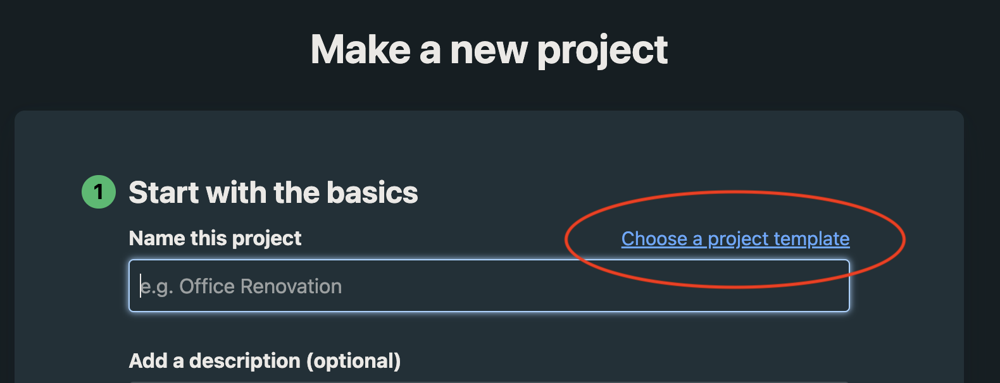
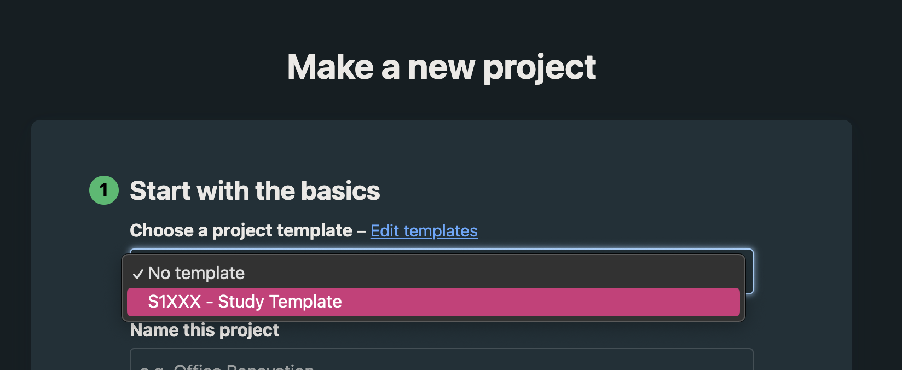

# Basecamp

## Adding a New Project to the [DCAN Labs Basecamp](https://3.basecamp.com/5032058/)

Aside from personal project boards and teams, all research projects associated with a PI must be assigned a project number and be tracked on a new Basecamp Project board. If you have questions about where on Basecamp something should be tracked or whether a new Basecamp Project board is needed or not, please reach out to the DCAN project managers directly for guidance. In order to obtain a project number and set up a Basecamp, please do the following:

**Step 1: Request a project number from the project managers**

Fill out the [Project Request Form](https://forms.gle/1ddNGf6pbe5WE2QV8) to request a project number. Please consult the list of [current active projects](https://docs.google.com/spreadsheets/d/1ZYwQIaH2aJP3ClCwHZL6pmaTSNGbAkg91co2ENcIYl0/edit?usp=sharing) to make sure that your project name is distinct. The PMs will also confirm that the project name and goals are distinct from exisiting projects.   

**Step 2: Create a new project on Basecamp utilizing the template**
 - Go to the Basecamp dashboard and select **Make a New Project** at the top of the page
 - Select **Choose a project template**
   
   

 - Select **S1XXX - Study Template** under **Choose a project template**
   
    

 - Fill out the necessary information. Under **Name this Project**, make sure to include the assigned project number and use the project name approved by the PMs (if you decide you want to change it later, that's ok, just make sure to loop in the PMs so that we can adjust our tracking sheets), eg: **S1010: CABINET Development**

**Step 3: Complete set up once Basecamp is created**

 - Add all necessary people to the project
 - Fill out the **Project Overview** under **Docs & Files**

 ## Personal Project Board Recommendations

If you do not have a personal board, you can create one for yourself following the instructions above and activate whichever tools you want to use (do not use a template). Personal boards are just that, personal. It can be used however you wish, below are some recommendations for things to add to your personal board.

**To-dos**
- Check-in related items
    - Recurring agenda prepping reminders
    - Items to remember to add to your agenda (this is best used for items that need to be asked about again)
- Professional Development
    - Recurring online course reminders
    - Performance evaluation-related tasks
    - Goal setting-related tasks
    - Courses to ask leadership about
    - Assignments within any courses you are taking
    - Papers to read
    - Lab meeting WIP related tasks
- Administrative
    - Any emails you need to send that are more personal or not specifically related to a project
    - Benefits-related tasks
    - Time-off related tasks like requesting coverage, prepping notes earlier than normal, etc
    - Updating your ORCID profile
- Workflow Improvement
    - Adding personal SSH keys
    - Installations
    - Gaining access to something
    - Set up on a given application
    - Reminders to restart your computer
    - Reminders to update applications
    - Tasks to learn about how to do something that would streamline your day-to-day
- Clean-up and Documentation
    - Reminders to update the data storage tracking sheet
    - Reminders to clean out frequently used testing directories and/or your home directory
    - Reminders to add utilities to GitHub

**Message Board**
- Commands that you use frequently personally and want to be able to copy paste
- Notes about any personal tasks, courses, or projects
- Notes about papers you are reading
- Links you want to remember

**Docs & Files**
- Notes for your 1:1 Check-ins
- Personal tracking documents

For questions, suggestions, or to note any errors, post an issue on our [Github](https://github.com/DCAN-Labs/cdni-brain/issues).