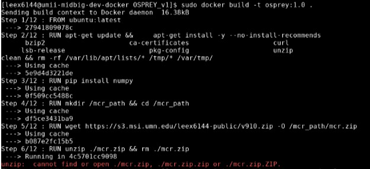

# Containers

Read:

* [Intro to Singularity and Docker Containers @ Cornell BioHPC](https://biohpc.cornell.edu/doc/singularity_v3.pdf)
* [Singularity on CentOS7 @ MSI](https://www.msi.umn.edu/support/faq/how-do-i-use-singularity-centos-7)
* [Singularity tutorial @ MSI](https://www.msi.umn.edu/tutorials/singularity-containers)
* [Singularity quick start guide @ Syllabus](https://docs.sylabs.io/guides/latest/user-guide/quick_start.html)

The primary container format used by DCAN Labs on MSI is Singularity. Containers are used to access multiple data files on a host system, by binding those files together within a container. **Note that Singularity by default mounts your home directory into the container, meaning the container is not fully isolated.** Recommended in general to use the `--cleanenv` and `--no-home` options when running a Singularity container to avoid potential issues caused by the user’s environment or home directory.

Singularity can pull and build Docker images from Dockerhub in Singularity format (note: Docker format images cannot be run on MSI as they require root permissions.) 

Example:

`ssh -Y mangi/mesabi/agate`

`srun -N 1 -n 1 -c 1 --mem=128G --tmp=200G -t 720 -p interactive --pty bash`

`module load singularity`

`singularity pull name_of_singularity_image.sif docker://path_to_docker_image`

Note: `name_of_singularity_image.sif` can be anything. Generally, it is advisable to name it with the name of the codebase + the date. Also, `dcanumn` will typically be involved in `/path_to_docker_image`. To pull a specific tag of a docker_image, add `:tag` at the end of the `/path_to_docker_image`

Containers are typically run with a **singularity run** command, as demonstrated in various [sbatch script examples](pipelines.md) in this handbook.

**singularity shell** launches a shell within the container, which is often useful for debugging. Will allow you to interact with the folders inside the container. 

`singularity shell name_of_singularity_image.sif`

To leave the shell, type `exit`.

For pulling Docker images, see [this document](https://docs.google.com/document/u/0/d/1w1g0kLSchPKvEI9pZIBmhavFd2Mq2-r82ozVaBuL9EI/edit). 

*Note: make sure MIDB’s Virtual Machine is accessible for you before pulling Docker images. [See here to go through the process](vm.md).*

## Building a Docker Container 

Before you build a container, you might need to get access to the VM at MSI where the container will be built. Find out [how to get access here](vm.md)

Once you have access, open a terminal at MSI and ssh into the VM

- Run `ssh umii-midbig-dev-docker.oit.umn.edu`

Assuming you have a github repository that has the dockerfile to build your image and any prerequisite files, download the repository to the machine

- Run `git clone html-to-repo --branch name-of-branch-to-clone`

- If you are asked for your credentials, enter your github username, then open Github and go to Settings -> Developer Settings (located at very bottom) -> Personal Access Tokens and click Generate New Token. Enter the new token ID as your password.

Navigate into the cloned repository 

- Run `cd name-of-repo`

Build the container with docker. The version (`1.0.` in the example command) is whatever you name it. Check the docker documentation for acceptable container names. If there is an existing repository on Docker hub, include `dcanumn` before `/pipeline` (i.e. `dcanumn/bibsnet:3.0.0`). If you want to build using cache files from previous builds (resulting in a faster build), do not include the `--no-cache` flag.

- Run `sudo docker build -t /pipeline-name:1.0. . --no-cache`

While you are building the container, docker moves line by line through the Dockerfile and builds new images at various points in the build process. If you encounter an error during this building process, you can load the most recent intermediary image created during the build process and run the remaining portion of your Dockerfile from there. Below is an example of what the error message might look like. 

- Run `sudo docker run -it b087e2fc15b5` to load the most recent image layer (from the above example)

- If you have the line similar to the `RUN unzip ./mcr.zip`, run it without the RUN statement (`unzip ./mcr.zip`) to get a better understanding of why your command is having issues.

- This will open the image (kind of like being in a singularity shell) from which you can run the next command from the Dockerfile (you don't need to include `&& \` if you're just running the one command)

- Once you are done with working in this shell, run `exit` to leave it. 

If the virtual machine runs out of memory while you're doing this try the following:

- Run  `docker system prune`; this is a good option if you've already removed larger files and containers

- Delete some of your old filles

- Delete specific containers by first finding their ID with `ls`, then removing them 

    - Run `sudo docker image ls` 

    - Run `sudo docker image rm alpha-numerica-container-id`

If you want to look into your container and test its behavior without running the command associated with its entrypoint, use the following command: 

- `sudo docker run -it --entrypoint /bin/bash/pipeline_name:pipeline_version`

If your container build was successful, then push it to Dockerhub (assuming there is an existing repository on Dockerhub)

- Run `sudo docker push dcanumn/container-name:version`

If you want to push the image with multiple tags, add tags to the image before you push, then include the `--all-tags` flag when pushing. Below is an example which would label the same build with the `v1.0` tag and the `stable` tag.

        sudo docker image tag container-name dcanumn/container-name:v1.0
        sudo docker image tag container-name dcanumn/container-name:stable
        sudo docker push --all-tags dcanumn/container-name

Start an interactive job on mesabi to use to build the container, requesting about twice the amount of temp space (`--tmp`) as the size of the container

- Example srun command: `srun -N 1 --ntasks-per-node=1  --tmp=100g --mem-per-cpu=30g -t 3:00:00 -p interactive --pty bash`

To build the singularity image from Docker Hub run: 

        module load singularity 
        cd /path/to/where/container/is/stored
        singularity pull name_for_singularity_image.sif docker://account/container_name:container_version

        * The account will probably be dcanumn *

If you pushed the image to Docker Hub, you do not need to also perform the following steps

If the build was successful but there is not a repository on Dockerhub for you to push to, save the build as a tar

- Run `sudo docker save pipeline-name:pipeline_version > /path/to/save/tar/image/pipeline_name_version.tar` 

Send the tar'd docker image to the main file storage system at MSI so that we can use the singularity instance installed at MSI to convert the docker image into a singularity image 

- Run `scp /path/to/tar/file/on/virtual_machine/pipeline-name.tar user_id@mesabi.msi.umn.edu:/path/at/msi/to/store/container/` 

To build the image from docker archive, grab an srun then run:

        module load singularity
        cd /path/to/where/container/is/stored
        singularity build name_for_singularity_image.sif docker-archive://pipeline-name.tar

## Special Container Builds 

**10.5T NHP ABCD BIDS Pipeline Synth**

**PLEASE NOTE: This does NOT apply to the regular NHP ABCD BIDS pipeline.**

This container needs to be built on the VM, it is too large to be built on DockerHub. This container will take up around 20GB of space so make sure to first check that there is enough space on the VM to build it. 

This pipeline doesn't use a layered build (with internal- and external-tools) like the normal NHP, Infant, and DCAN ACBD BIDS pipelines use. It instead uses gitsubmodules and gitlfs to link certain dependencies such as the DCAN Bold Processing repo and the macaque image templates. 

In order to build this container, you first need to clone the correct repository and initialize the git submodules. You can do this by running the following commands: 

                git clone git@github.com:DCAN-Labs/nhp-abcd-bids-pipeline-synth.git
                cd nhp-abcd-bids-pipeline-synth
                git submodule update --init

After this, you will need to run the download script in the tools subdirectory to download the templates used in the pipeline. 

- `./tools/download-templates.sh`

Once you run this, check for the existance of a *templates* folder under *scripts/dcan_macaque_pipeline/global/* 

Be sure that Docker BuildKit is enabled by adding `DOCKER_BUILDKIT=1` before your build command. An example docker build command would be

`sudo DOCKER_BUILDKIT=1 docker build . -t dcanumn/nhp-abcd-bids-pipeline-synth:[tag]`

If you need to update the link to the git submodule, for example if there are updates to the DCAN Bold Processing repo that you want to incorporate into this pipeline, this can be done by following [this example](https://stackoverflow.com/questions/1777854/how-can-i-specify-a-branch-tag-when-adding-a-git-submodule/1778247#1778247) which is noted below. 

If you want to move the submodule to a particular tag:

                cd submodule_directory
                git checkout v1.0
                cd ..
                git add submodule_directory
                git commit -m "moved submodule to v1.0"
                git push

If updating DCAN Bold Processing, the <submodule_directory> would be the path to the DCAN Bold Processing `/nhp-abcd-bids-pipeline-synth/scripts/dcan-bold-processing/`

Then, another developer who wants to have submodule_directory changed to that tag, does this

                git pull
                git submodule update --init