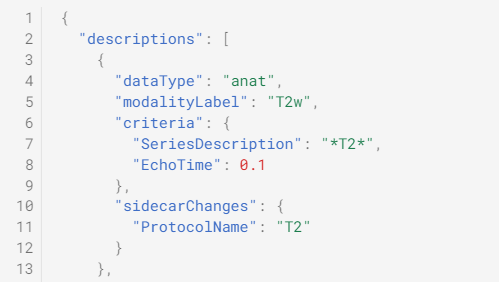
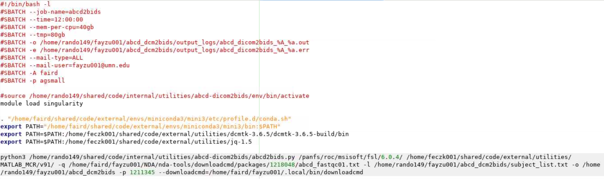

# DICOM to BIDS Conversion (Dcm2bids)

**NOTE: this document describes usage of Dcm2bids 2.1.x as used in the `dcm2bids` and `dcm2bids_xa30_test` labwide conda environments -- if using the `dcm2bids3` environment (intended for use with the [Dcm2bids3 NORDIC wrapper](nordic.md), refer to the Dcm2bids 3 documentation page linked below for information on breaking changes introduced in Dcm2bids 3**

Read: [Dcm2bids 2.1.9 documentation page](https://unfmontreal.github.io/Dcm2Bids/2.1.9/)

Read: [Dcm2bids 3 documentation page](https://unfmontreal.github.io/Dcm2Bids/current/)

Watch: [Dcm2bids DCAN tutorial recording](https://drive.google.com/drive/folders/1OgyqFfpqp3qWg4OJzY9ADTwV26j8fJYf) 

`Dcm2bids` is a tool to convert data from DICOM format into proper [brain imaging data structure (BIDS)](https://bids-specification.readthedocs.io/en/stable/)

`Dcm2bids` can be loaded via the labwide Miniconda’s **dcm2bids** environment. (See **(b)** further down in this section.) 

11. `dcm2bids` requires a configuration file specifically tailored to the contents of the JSON “sidecar” files that contain metadata for the image files. The config file is a way to uniquely identify each file that needs to be converted.
    * Example section: 
        
        
        
    * Above is an example of a description field, which describes an acquisition, in this case a T2-weighted image. 
        
    * The `dataType` field is mandatory for any acquisition. It is a functional group that will define different types of data: func, dwi, fmap, anat, meg, and beh.
        
    * The `modalityLabel` is also mandatory. It describes the modality of the acquisition, such as `T1w`, `T2w`, `dwi`, or `bold`.
        
    * The `criteria` section is used to match unique identifiers in the sidecar files with values entered in the section. `SeriesDescription` will find any file that contains the specified value. In this example, `SeriesDescription` is looking for any file that contains the characters T2 somewhere in the file name. It is also looking for `EchoTime` fields with a value of 0.1.
        
    * The `sidecarChanges` field is optional and it will change or add any information in the sidecar file. In this example, the field `ProtocolName` with the value of T2 is being adjusted in the sidecar.
    
12. Commands used to convert files from DICOMs to NIfTIs:
        
     *  `source /home/faird/shared/code/external/envs/miniconda3/load_miniconda3.sh`
        
    * `conda activate dcm2bids`
            
        - For multi-echo data, or data acquired on a scanner with the XA30 software package, use `conda activate dcm2bids3` if using the Dcm2bids3 NORDIC wrapper (note you must update your config files to be dcm2bids3 compatible --  see https://unfmontreal.github.io/Dcm2Bids/3.0.2/upgrade/#upgrading-from-2x-to-3x for a summary of breaking changes between 2.x and 3.x), else use `conda activate dcm2bids_xa30_test`
        
    * `dcm2bids_helper -d /path/to/input/dir/ -o /path/to/output/dir/`
            
        - The input directory ( `-d` ) contains the original dicom files.
            
        - The `-o` flag is optional. It will create a directory for the output either in your input directory or in the output directory you specify.
            
        - The `dcm2bids_helper` will give you an example of the sidecars. You can use the helper with the dicoms of one participant. It will utilize `dcm2niix` and save the result inside the `tmp_dcm2bids/helper` of the output directory. 
        
        * After completing your config file, to run dcm2bids, first cd into your BIDS directory. Then use this command: `dcm2bids -d /path/to/input/dir/ -p participant_id -c /path/to/config_file.json`
    
13. For ABCC data, `abcd-dicom2bids`: used for selectively downloading ABCD Study imaging DICOM data QC'ed as good by the ABCD DAIC site (fast track qc), converting it to BIDS standard input data (see [here](https://www.google.com/url?q=https://collection3165.readthedocs.io/en/stable/recommendations/%233-the-bids-quality-control-file&sa=D&source=docs&ust=1660838354455769&usg=AOvVaw1E2rTHf_kzVv2xtxsQYDlw)), selecting the best pair of spin echo field maps, and correcting the sidecar JSON files to meet the BIDS Validator specification. `abcd-dicom2bids` still uses `dicom2bids`, but uses a config file that is specific to ABCC. See more information on the [repository](https://www.google.com/url?q=https://github.com/DCAN-Labs/abcd-dicom2bids&sa=D&source=docs&ust=1660838354453985&usg=AOvVaw2qzX3n8wO5qBFYaDgbMIMn). For information on how to use the fast track qc, navigate to [this section](fasttrack.md). It is important to note that when running `abcd-dicom2bids` , cache can fill up in your home directory under `/home/{share}/x500/x500/` , so check up on and delete files within this directory when necessary. 
        

    * Example run command for a list of subjects, with good sbatch specs:

        
        
        - In the run command, `-q` is the path to quality control (QC) spreadsheet file downloaded from the NDA,`-l` is the list of subjects being converted, `-o` is where the outputs are being stored, `-p` is the package ID number of relevant NDA data package, `--downloadcmd` is the path where the downloadcmd has been installed.
        
        - For more information on arguments, see the ReadMe section on Optional Arguments [here](https://github.com/DCAN-Labs/abcd-dicom2bids).
        
        - For running multiple subjects, it is advised to use a [wrapper ](#17-s3-pipeline-wrappers)to submit one subject/session at a time. There is a wrapper for tier 1 here: `/home/faird/shared/code/internal/utilities/slurm_pipeline_wrappers/slurm_abcd-hcp-pipeline_scripts` and a wrapper for tier 2 here: `/home/faird/shared/code/internal/utilities/slurm_pipeline_wrappers/slurm_abcd-hcp-pipeline_scripts_with_s3_routines_with_ses`
            
            * Note: if you do not have access to the faird share, please fill out [this contact form](https://innovation.umn.edu/developmental-cognition-and-neuroimaging-lab/contact-us/) to request access.
