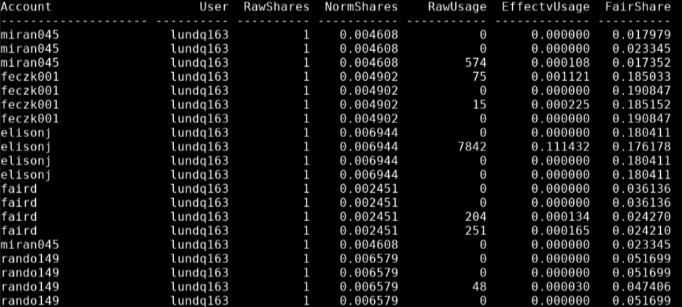

# Fairshare

Read: [HPC Fairshare scheduling @ MSI](https://www.msi.umn.edu/content/hpc)

The goal is to increase the priority when scheduling jobs. When a group has recently used a large amount of resources, the priorities of their waiting jobs will be negatively affected until their usage decreases.

`sshare -U x500`: checks all of the accounts a user has access to at once

   * Below is an example of a terminal output after running the above command:
   * Based on the values in the `FairShare` column, the larger numbers will receive higher priority when running jobs. So with the above output, the user would want to submit jobs using `feczk001`.

For checking the fairshare of a specific account, use `sshare --account=$account_name -a`: $account_name is the group account that you want to check the fairshare of. The group account names are: **miran045**, **faird**, **feczk001**, **rando149**. 

* The number within the `FairShare` column is a fraction of the total fairshare remaining, with larger numbers meaning a higher priority and smaller numbers meaning a lower priority 
* For more detail, [watch this video](https://www.youtube.com/watch?v=uKeMHDo1BkM).