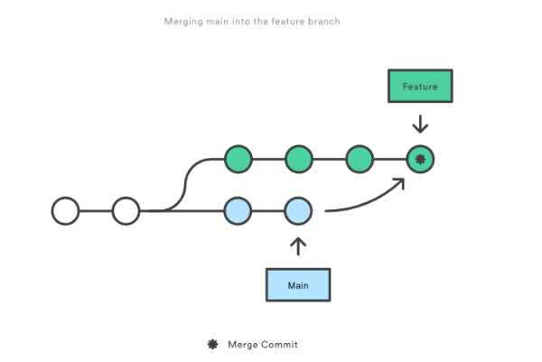

# Other GitHub Tips

## Good Practices

1. Make your commit messages short but descriptive.
    - "changed stuff" -> "added comments to run.py funcs"
2. Commit often
    - This ensures that you don't lose information.
    - Also, it makes it so you have less very large commit messages.
2. Combine your work and personal GitHub's sooner rather than later.
    - Having these separate instinctively seems correct, but it is easier to have one GitHub account to maintain.
3. Pin your biggest code projects to the top of your profile.
    - In this lab, we interact with A LOT of codebases quite regularly. Pinning your main projects ensures they don't get lost.
4. There are certain commands that are easier on command line, and certain commands that are easier with IDE extensions.
    - EX: Commits, staging commits, pushes, pulls (everyday tasks) are easier via [vscode source control](vscode.md). I recommend exploring that page often.
    - EX: [Scrubbing a repository](github-scrub.md) of a commit or data within a commit is easier via command line.
5. Put a README.md within all your codebases, even if you are the only person using it.
    - You will forget how to run you own code, trust me.
6. Get a DOI for your codebase if it is being used by others.
    - This is usually done via [zenodo](zenodo.md).
    - People will be able to credit you and reference specific commits with this.
7. [Add a README.md to your profile](https://docs.github.com/en/account-and-profile/setting-up-and-managing-your-github-profile/customizing-your-profile/managing-your-profile-readme).
    - Include your linked in, projects your working on, your focus, other websites, recent publications, etc
    - More information on how to personalize your GitHub profile can be found [here](https://docs.github.com/en/account-and-profile/setting-up-and-managing-your-github-profile/customizing-your-profile/personalizing-your-profile).
8. Keep your branches updated
    - Frequently [pull to and sync from your local branch](https://docs.github.com/en/desktop/working-with-your-remote-repository-on-github-or-github-enterprise/syncing-your-branch-in-github-desktop)
    - When intending to submit a [pull request](https://docs.github.com/en/pull-requests/collaborating-with-pull-requests/proposing-changes-to-your-work-with-pull-requests/about-pull-requests), merge with the branch you're intending to submit the PR to locally before initiating the request. This ensures you won't have any merge conflicts.

## Watch a Repo 

Watching a repo will enable email notifications any time a certain event happens on the repo. This is a good way to stay in the know about what's going on in your repo. To watch a repo, follow these steps:

- On the repo you want to watch, in the upper right corner, there should be a `watch` menu that you can select
- Select what level you want to watch at
    * You can create a custom option if you only want to be notified of certain events (pull requests and issue postings for example)

## Common Issues

### VSCode: Pushing from a Local Branch 

If your branch doesn't exist on the remote repository, you'll need to select "OK" when VSCode prompts you with "The branch "your_branch_name" has no remote branch. Would you like to publish this branch?" 

Note: I'd recommend clicking "OK, Don't Ask Again," - but this is a personal preference.

Within the source control page, under Branches, you can also select the cloud next to your branch to publish it.

If your branch already exists, but has been deleted from the GitHub repo, trying to push your commits from the VSCode source control panel might throw you an error about not being able to find the remote head. Instead, use the command line to push your commits. This will republish your branch on GitHub and make you able to use the VSCode source control to push/pull commits again.

### Unable to pull due to Divergent Branches

This means that the branch you started your local branch with is out of date from the remote branch on GitHub.

You can run the following commands once to fix it.

- `git pull --rebase`
- `git pull` on your other branch, then `git merge` on your branch

In order to set this, type either of the following:
-  `git config pull.rebase false` to merge 

    
    Source: https://www.simplilearn.com/what-is-git-rebase-command-article

-  `git config pull.rebase true` to rebase (recommended)

    
    Source: https://www.simplilearn.com/what-is-git-rebase-command-article

-  `git config pull.ff only` to fast-forward only

Note: A lot of people feel very passionate about always rebasing online, because intertwined commits are confusing.
