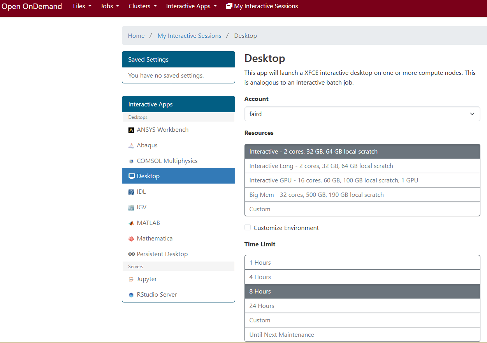

# High-Performance Computing (HPC) Resources 

[Read: HPC @ MSI](https://www.msi.umn.edu/content/interactive-hpc)

MSI offers an intensive amount of computing resources and several options for remote access. These allow you to access stored data, run processing jobs, and perform other computing-intensive tasks. 

<div class="admonition attention">
    <p class="first admonition-title">Attention</p>
    <p class="last">
        Please be aware that MSI undergoes maintenance on the first Wednesday of each month. This may extend and affect MSI performance for the entire week of maintenance Wednesday.
    </p>
</div>


## Open OnDemand

Open OnDemand is a web portal that can be used for accessing MSI's compute clusters in your browser. This allows you to essentially open a Virtual Machine on MSI so that you can interact with it as a normal computer. You can use it to access files on MSI and process/analyze data. You can also open other software apps, like R and MATLAB, which will also be able to access MSI's computing power.

* Log in to the [Open OnDemand website](https://ondemand.msi.umn.edu/pun/sys/dashboard/)
* Select *Interactive Apps* at the top and select which Desktop you would like
* The *Persistent Desktop* should run until the next maintenance day 
* The *Desktop* will run for however long you choose
* Choose which account, how many resources, and how long you need the Desktop to run.
    * Normally the "Interactive" set of resources is enough. You can always grab more within the session using an srun (discussed below).   
    * Once the Desktop "dies", you will not be able to reaccess any windows you had open. 
* Several other apps are available, including MATLAB and RStudio Server
    


## Secure Shell (SSH)

You can also directly access MSI via your local computer terminal via SSH. This is a secure way for administrators to access and manage remote computers over the internet, offering protection for data and allowing tasks like logging in, transferring files, and executing commands.
More information about how to set up an SSH connection can be found on the [UMN SSH page](https://it.umn.edu/services-technologies/resources/use-secure-shell-ssh) and on the [Getting Started page](msi-login.md#logging-in-to-msi). 

## srun 

An srun is an interactive [SLURM](slurm.md) job that allows you to request a compute node, which has more computing resources, for a given terminal. This can be requested from an SSH connection or from an OOD terminal. Our [SLURM Jobs page](slurm-params.md#srun) has more information on how and when to use an srun. 

## SBATCH

SBATCH is a tool used at the Minnesota Supercomputing Institute (MSI) to send tasks to the SLURM system for processing. Users create scripts detailing resource needs like time, processors, memory, and email notifications. These scripts are then submitted using sbatch, which adds the job to a queue and allows the job to run in the background. For more information, refer to the [MSI Job Submission and Scheduling page](https://www.msi.umn.edu/content/job-submission-and-scheduling-slurm), [official SLURM documentation](https://slurm.schedmd.com/documentation.html), and [our internal SBATCH page](slurm-params.md#sbatch)

## Jupyter Notebooks

A web portal for notebook-based computing in the browser, it can be used for reproducible and shareable data analysis, visualization, and scripted control of larger tasks. It currently supports Python 2, Python 3, and R. It is offered on OOD as a server.

* Great for playing around with a database initially
* Formalizing code here is not recommended

## Tier 1 Storage

This is the primary filesystem that is used for interactive file manipulation. PI's have a default allocation of 5TB but can request up to 20TB (which used to be the old default). You can check a share's quota with the command `groupquota -g <share>`. 

- If a group reaches 90% capacity, it becomes locked down, meaning no new files can be created and functionality will slow down.
- It is especially important to keep the `faird` share clean as this is the default share that new users and outside collaborators are given access to. 

The only data stored on tier 1 should be data that is being actively used. 

- If you want to store more than 1TB of data (or more than 500GB of data on `faird`), please fill out [this storage request form](https://docs.google.com/forms/d/e/1FAIpQLSd1QI_Hmi3khwITVctnaDJYY2M1NegsAWYPR6AXoodUCrrpZw/viewform).

MSI takes "snapshots" every night of the tier 1 space. This means if you want to see an older version of a file or need to recover something that was accidentally deleted, you can enter the hidden `.snapshot` folder that lives in every directory to see the backups. Every week, it will consolidate the snapshot into a weekly snapshot and store those for up to a month. Please keep in mind that means these backup folders **are only stored for a month at most**.

Each PI has their own allocation on MSI, which includes storage and compute time. As one account becomes more active, it becomes deprioritized relative to all other accounts on MSI. See [our Fairshare page](fairshare.md) for more information about how prioritization works. These are the current PI groups within CDNI:

* Rick Betzel: `rbetzel`
* Damien Fair: `faird`
* Eric Feczko `feczk001`
* Jesse Kowalski: `kowal225`
* Bart Larsen: `bart`
* Oscar Miranda-Dominguez: `miran045`
* Julia Moser: `moser297`
* Steve Nelson: `smnelson`
* Anita Randolph: `rando149`
* Brenden Tervo-Clemmens: `btervocl`

Each share on MSI follows a similar directory structure:

```
|--projects
    |--standard
       |--<group>
          |--shared
             |--code
                |--external
                    |--pipelines
                    |--utilities
                    |--analysis
                    |--envs
                |--internal
                    |--same subdirs as external
             |--projects
             |--data
          |--<old_home_dirs>
```

* If you are working on something that other people might need access to, it is best to create a directory under `projects`. 
* Each user has their own home directory that is separate from the PI's share. If you were added to MSI before the summer of 2024, you also still have your old home directory under the PI share. These are read and write protected directories, meaning **only you** have access to read and write to them. You have the ability to open them up, but it is not recommended.

## Scratch Space

`/scratch.global/` is an open filesystem that is accessible for any MSI user. Each group still has a quota, but here it is 40TB and 10 million files. Data in global scratch is deleted after 30 days (meaning 30 days after the data was first put into scratch). This is helpful for if you are running jobs that produce large outputs that you want access to right away (instead of pushing them to the s3) or when you only need the outputs stored temporarily. 

Most users create their own x500-named working directory, i.e. `/scratch.global/faird/` to work under.

You can read more about [MSI's scratch space here](https://msi.umn.edu/about-msi-services/data-storage/high-performance-storage/scratch-storage)

For questions, suggestions, or to note any errors, [post a Github issue](https://github.com/DCAN-Labs/cdni-brain/issues).
