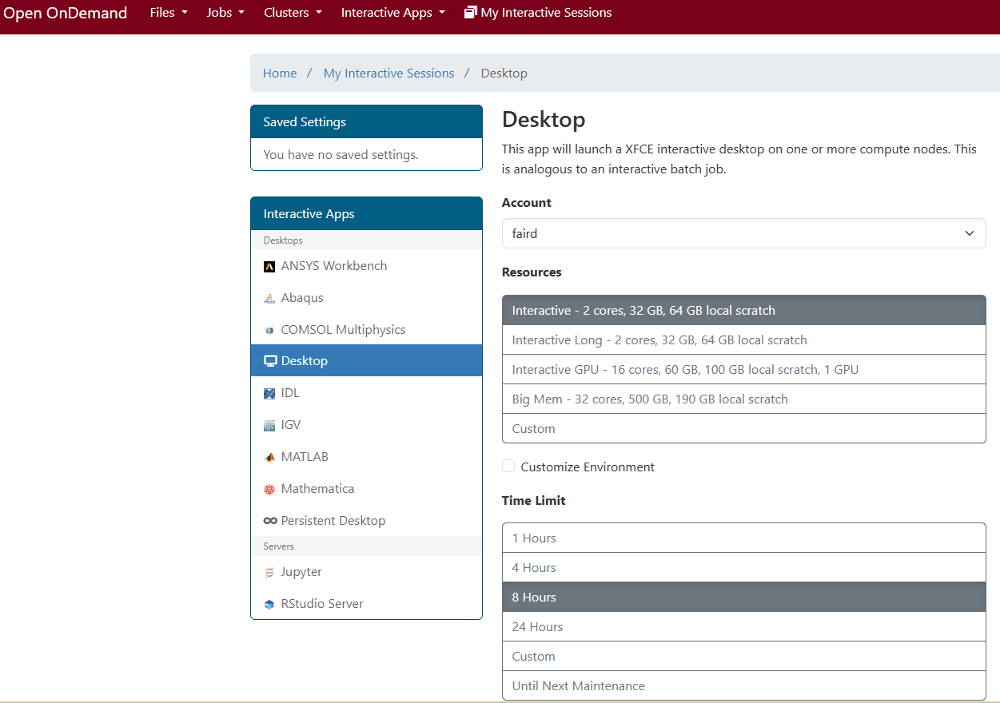

# High-Performance Computing (HPC) Resources 

[Read: HPC @ MSI](https://www.msi.umn.edu/content/interactive-hpc)

MSI provides high-performance computing resources for storing and accessing research data, running computational workflows, and performing other resource-intensive tasks.

For an overview of MSI's current computing resources and documentation, see the [MSI User Documentation](https://userdocs.msi.umn.edu/).

<div class="admonition attention">
    <p class="first admonition-title">Attention</p>
    <p class="last">
    !!! warning
    MSI typically undergoes scheduled maintenance on the first Wednesday of each month. Jobs may remain pending if their requested runtime would overlap the upcoming maintenance period. Check the [MSI status page](https://status.msi.umn.edu/) for current maintenance notices and service updates.    
    </p>
</div>


## Open OnDemand

Open OnDemand is MSI's browser-based interface for accessing compute resources, files, terminal sessions, interactive desktops, and supported applications.

For current instructions on launching desktops and other interactive applications, see the [MSI Open OnDemand documentation](https://userdocs.msi.umn.edu/compute/open-ondemand-support.html).

You can access Open OnDemand directly at [ondemand.msi.umn.edu](https://ondemand.msi.umn.edu/).
    


## Secure Shell (SSH)

MSI can also be accessed from a local terminal using SSH. SSH can be used to access MSI login nodes, navigate files, submit jobs, and begin interactive computing sessions.

For current SSH setup and connection instructions, see the [MSI SSH Keys documentation](https://userdocs.msi.umn.edu/connect/ssh_keys.html) and [Connecting to Compute](https://userdocs.msi.umn.edu/connect/connect_compute.html).

## srun

`srun` can be used to request an interactive compute session from an MSI login node or Open OnDemand terminal. Interactive sessions should be used for computational work that should not be performed directly on a login node.

For current `srun` syntax and interactive computing guidance, see the [MSI Interactive HPC documentation](https://userdocs.msi.umn.edu/compute/interactive_compute.html).

For CDNI-specific Slurm examples and recommendations, see our [SLURM Jobs page](slurm-params.md).

## SBATCH

`sbatch` is used to submit non-interactive batch jobs to MSI's Slurm scheduler. Batch scripts specify the resources required by a job and the commands that should be executed.

For current MSI guidance on writing, submitting, monitoring, and canceling Slurm jobs, see the [MSI Slurm Job Submission and Scheduling documentation](https://userdocs.msi.umn.edu/compute/slurm_job_submission.html).

For CDNI-specific examples and recommendations, see our [SBATCH page](sbatch.md).

## Jupyter Notebooks

Jupyter provides browser-based notebook environments for interactive data analysis, visualization, and exploratory scripting. Jupyter environments can be launched through MSI's Open OnDemand interface.

* Jupyter notebooks can be useful for initial data exploration and testing.
* For production or formalized workflows, scripts and version-controlled code are generally preferred.

For information about accessing interactive applications through Open OnDemand, see the [MSI Open OnDemand documentation](https://userdocs.msi.umn.edu/compute/open-ondemand-support.html).

## Tier 1 Storage

Tier 1 is MSI's high-performance filesystem for active research data. It includes user home directories, project spaces, and Global Scratch.

For current Tier 1 allocations, quotas, paths, snapshots, and storage policies, see the [MSI File Storage documentation](https://userdocs.msi.umn.edu/storage/storage.html).

Within CDNI, it is especially important to keep the `faird` share organized because it is commonly used by new users and outside collaborators.

The only data stored on Tier 1 should generally be data that is actively being used. If you want to store more than 1 TB of data, or more than 500 GB of data on `faird`, please fill out [this storage request form](YOUR_EXISTING_LINK_HERE).

CDNI researchers may have access to different MSI project groups depending on their PI and project. Slurm scheduling priority can also be influenced by resource availability and group fairshare.
For general information about MSI job scheduling and resource availability, see the [MSI Slurm Job Submission and Scheduling documentation](https://userdocs.msi.umn.edu/compute/slurm_job_submission.html).
These are the current PI groups within CDNI:

* Rick Betzel: `rbetzel`
* Damien Fair: `faird`
* Eric Feczko `feczk001`
* Jesse Kowalski: `kowal225`
* Bart Larsen: `bart`
* Oscar Miranda-Dominguez: `miran045`
* Julia Moser: `moser297`
* Steve Nelson: `smnelson`
* Anita Randolph: `rando149`
* Brenden Tervo-Clemmens: `btervocl`

Within CDNI, project shares generally follow a directory structure similar to the example below. This organization contains CDNI-specific conventions within MSI's standard project space:

```
|--projects
    |--standard
       |--<group>
          |--shared
             |--code
                |--external
                    |--pipelines
                    |--utilities
                    |--analysis
                    |--envs
                |--internal
                    |--same subdirs as external
             |--projects
             |--data
          |--<old_home_dirs>
```
For MSI's general project-space and shared-directory structure, see the [MSI File Storage documentation](https://userdocs.msi.umn.edu/storage/storage.html).

* If you are working on something that other CDNI members may need to access, use the appropriate shared project location rather than your private home directory.
* MSI home directories are intended for personal configuration, source code, and smaller working files. Shared research data should generally be stored in the appropriate project space.

For current guidance on home directories, project space, and shared storage, see the [MSI File Storage documentation](https://userdocs.msi.umn.edu/storage/storage.html).

## Scratch Space

Global Scratch is MSI's temporary high-performance storage space for short-lived job data, staging, and intermediate outputs. It should not be used for long-term or irreplaceable data.
Data in Global Scratch that is older than 30 days is automatically deleted, and Global Scratch is not protected by snapshots or backups.
For current paths, quotas, retention policies, and recommended usage, see the [MSI File Storage documentation](https://userdocs.msi.umn.edu/storage/storage.html).

For questions, suggestions, or to note any errors, [post a GitHub issue](https://github.com/DCAN-Labs/cdni-brain/issues).
