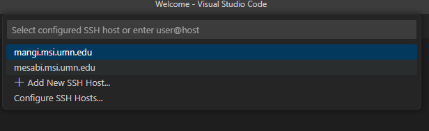

# Interactive High Performance Computing (HPC) Resources 

Read: [Interactive HPC @ MSI](https://www.msi.umn.edu/content/interactive-hpc)

MSI offers several options to remotely access HPC resources. These will allow you to access stored data, run processing jobs, and other computing heavy tasks. **Note:** The first Wednesday of every month, MSI will be down for maintenance. Sometimes this spills over and can effect MSI performance for the whole week. 

* **Open OnDemand**: A web portal to access MSI's compute clusters in your browser, which can be used for accessing MSI files and running jobs.
    * Select *Interactive Apps* at the top and select which Desktop you would like
    * The *Persistent Desktop* will run until next maintenance day 
    * If selecting *Desktop* choose which cluster, how many resources, and the time you need 
    * Agate is good for visualization and GPU utilization
    * Mesabi is good for running long jobs 
    * Several other apps are available, including MATLAB and RStudio Server

* **Jupyter Notebooks:** A web portal for notebook-based computing in the browser, which can be used for reproducible and shareable data analysis, visualization, and scripted control of larger tasks. Currently supports Python 2, Python 3, and R. Offered on OOD as a server.
    * Great for playing around with a database initially
    * Formalizing code here is not recommended
* **Terminal:** User input might come through a command line interface (i.e., system shell) while debugging a piece of software 
    * Great for working with codebases on VScode
* **srun:**  Submit an interactive job on the current HPC system (OOD or Terminal) to provide a command line or graphical interface to interactively run software.
    * Needed for running programs / visualizing data for more than 15 minutes on any system listed above

## Setting up your .bashrc

.bashrc is a Bash shell script that runs every time you start an interactive session and it lives in your home directory. In order to access your .bashrc, open a new terminal in an OOD session and run `cat .bashrc` to see what it currently is or run `emacs .bashrc` to open it in an editor if you need to make changes. 

Here is a template for what your .bashrc should look like

            # .bashrc startup script for login shells
            #

            # Set your umask.
            # umask 077       # -- private, only you have access to your files
            # umask 022     # -- anyone can read and execute your files
            # umask 027     # -- only members of your group can read/execute your files
            umask 007    # -- created files may take upto read/write/execute

            # Set the prompt.
            PS1="\u@\h [\w] % "

            # Add your aliases here.
            # alias s='ssh -X'

            # Set your environment variables here.
            # export VISUAL=vim

            # Uncomment the if statement below to enable bash completion.
            # if [ -f /etc/bash_completion ]; then
            #  source /etc/bash_completion
            # fi

            # Load modules here
            # module load

            export PATH=/home/dhp/public/storage/s3policy_bin/:$PATH

            grephist() { # Search through my most recent commands
                touch ~/.history.txt

                # Default values for input arguments
                to_show=10;   # -n
                to_check=50000; # -d

                search_for=(); # List of terms to search through command history for
                filter_out=(); # List of terms to exclude from search results

                search_fn="tail" # By default, show the NEWEST (MOST RECENT) commands

                while [ "${1}" != "" ]; do # Iterate over all input args
                    case ${1} in
                    -n | --lines) # Number of results to echo in output
                        shift
                        to_show=${1}
                        ;;
                    -d | --depth) # Number of commands in history to check
                        shift
                        to_check=${1}
                        ;;
                    -v | -x | --exclude) # Term to exclude from search results
                        shift
                        filter_out=(${filter_out[@]} "${1}");
                        ;;
                    -i | --initial | --inverted | --head) # Show OLDEST commands
                        search_fn="head"
                        ;;
                    -h | --help)
                        echo "Usage: grephist [-n lines] [-d depth] [SEARCH_TERM_1] [SEARCH_TERM_2]... -v [EXCLUDE_TERM_1] -v [EXCLUDE_TERM_2]...
            Search through entire command history to find specific term(s) in past commands,
            and then echo the most recent commands to use the term(s).
            Options:
                -d, --depth:      Number of commands in command history to check. Default: ${to_check}
                -n, --lines:      Number of lines to echo in output. Default: ${to_show}
                -v, -x, --exclude:   Search term(s) to filter out.
                -i, --inverse, initial Include this flag to search OLDEST commands. Otherwise, will search NEWEST.
            ";
                        return 1
                        ;;
                    *)
                        search_for=(${search_for[@]} "${1}");
                    esac
                    shift
                done

                # Type validation: Ensure that -n and -d are integers
                for eachinput in $to_show $to_check; do
                    if ! $(is_valid_whole_number $eachinput); then
                        echo "Error: ${eachinput} is not a positive integer." >> /dev/stderr;
                        return 1;
                    fi
                done

                # Get contents of command-history text file
                search_cmd="${search_fn} $(fullpath ~)/.history.txt -n ${to_check}"

                # Filter for each search term
                for each_term in ${search_for[@]}; do
                    search_cmd="${search_cmd} | grep ${each_term}";
                done

                # Filter out search terms
                for exclude_term in ${filter_out[@]}; do
                    search_cmd="${search_cmd} | grep -v ${exclude_term}";
                done

                # Display the result
                search_cmd="${search_cmd} | ${search_fn} -n ${to_show}"
                eval ${search_cmd}
            }

            is_valid_whole_number() {
                [[ "${1}" =~ ^[0-9]+$ ]]; return ${?};
            }

            fullpath() {
                if [ $# -ne 0 ]; then
                    for eacharg in "$@"; do
                        if [ -f $eacharg ] || [ -d $eacharg ]; then
                            fullpath_convert $eacharg
                        else
                            echo "Error: ${eacharg} not found." >> /dev/stderr;
                        fi
                    done
                else
                    fullpath_convert ${PWD};
                #    echo Usage: fullpath \$some_relative_path
                fi
            }

            fullpath_convert() {
                inpath=${1};
                abs_inpath=$(realpath ${inpath});
                if [ "$(echo $abs_inpath | grep /panfs/ | grep /groups/)" = "" ]; then
                    echo $abs_inpath
                else
                    echo /home/${abs_inpath#*/panfs/*/groups/?/};
                fi
            }

            # Automatically save every command into a text file to save history
            PROMPT_COMMAND='echo "$(date +"%Y-%m-%d %H:%M") $(history | tail -n 1)" >> ~/.history.txt'

The three things you'll most likely need change from your original .bashrc are

- Add `umask 007` to allow all the files you create to automatically give the group and user read/write/execute permissions

- Add `export PATH=/home/dhp/public/storage/s3policy_bin/:$PATH` to be able to set s3 policies, which is neccessary for adding people to your s3 bucket (more information [here](s3.md))

- Add the `grephist()` function, which will allow you to see all of your previous commands you've made. The MSI history function will only show the commands you've made from that session but this command saves every command you've written since you've added this function. Below is the usage again to make it easier to find and read

            Usage: grephist [-n lines] [-d depth] [SEARCH_TERM_1] [SEARCH_TERM_2]... -v [EXCLUDE_TERM_1] -v [EXCLUDE_TERM_2]...
            Search through entire command history to find specific term(s) in past commands,
            and then echo the most recent commands to use the term(s).
            Options:
                -d, --depth:      Number of commands in command history to check. Default: ${to_check}
                -n, --lines:      Number of lines to echo in output. Default: ${to_show}
                -v, -x, --exclude:   Search term(s) to filter out.
                -i, --inverse, initial Include this flag to search OLDEST commands. Otherwise, will search NEWEST.

## Connecting to MSI with VS Code

First, if you have not downloaded VS Code, [install it](https://code.visualstudio.com/download) on your local computer. 

There are several recommended extensions to download through the Extensions Marketplace

- Remote-SSH (needed to connect to MSI)

- Git Graph (a helpful tool for visualizing your git history of commits, merges, branches, etc)

- Python

- Pylance

- Jupyter

If you are not connected to the university network, [connect to a VPN](https://it.umn.edu/services-technologies/virtual-private-network-vpn)

Next you will need to setup SSH keys that will allow you to connect to MSI.

- Open a terminal on your local computer and run `ssh-keygen`

- Copy the contents of `~/.ssh/id_rsa.pub` 

- Open an OnDemand session and open a fresh terminal in your home directory

- In the `~/.ssh/` folder, create an `authorized_keys` file and paste in the ssh key you copied earlier

- Run `chmod 600 ~/.ssh/authorized_keys` after you add the key. This will ensure that the ssh server will see this file

- See [this link](https://www.msi.umn.edu/support/faq/how-do-i-setup-ssh-keys) for more help

Now you need to edit the ssh config file on your local computer to be able to connect to MSI servers.

- Copy the following text into your `~/.ssh/config` file on your local computer, changing USERNAME to your x500. The port numbers are arbitrary and can be changed freely. 

        XAuthLocation /opt/X11/bin/xauth
        ServerAliveInterval 60
        ServerAliveCountMax 120

        Host mangi.msi.umn.edu
        HostName mangi.msi.umn.edu
        User USERNAME
        LocalForward 12326 localhost:12326

        Host cn*
        ser USERNAME
        ProxyCommand ssh -L 12326:localhost:12326 -W %h:%p mangi.msi.umn.edu
        LocalForward 12326 localhost:12326
        ForwardX11Trusted yes

        Host mesabi.msi.umn.edu
        HostName mesabi.msi.umn.edu
        User USERNAME
        LocalForward 12325 localhost:12325
        ForwardX11Trusted yes

        Host acn*
        User USERNAME
        ProxyCommand ssh -L 12325:localhost:12325 -W %h:%p mesabi.msi.umn.edu
        LocalForward 12325 localhost:12325
        ForwardX11Trusted yes

Time to actually connect to MSI!

 - Under the View tab, open the Command Palette and search for Remote SSH: Connect to Host. Mangi and Mesabi should both be listed as options.

    

    

    

 - Select a cluster, this is open a new window that will prompt you for the ssh password you set up when you set up your keys

 - In the bottom right corner a box with pop up that says "Setting up SSH Host cluster.msi.umn.edu (details)", click details to complete the DUO authentification 

 - Now you will need to install the same extensions as before but on the remote server  
    
    - Refer to the instructions as earlier, just make sure you are connected to MSI

It is best to not run VS Code on a login node, as it takes up a decent amount of CPU and memory to run, so instead connect to a compute node.

- Once you are connected to MSI, open a new terminal and grab an srun

    - `srun --time=8:00:00 --ntasks=2 --mem=32G --tmp=20G --pty bash -l`

- Make a note of the compute node you are allocated (`cnXXX` or `acnXXX`)

- Open the command palette again and select Remote-SSH: Connect to Host and enter the compute node 

- You'll be prompted to enter your ssh password and duo again

- It will also ask you to save the host fingerprint, select Continue/yes then enter your ssh password again to connect

When you are done using MSI, it is good practice to close the connection

- Click the box in the very bottom left side of the screen that says SSH: cluster.msi.umn.edu

- A command palette box will pop up in the top middle of your screen. Select Close Remote Connection.

If your session keeps timing out before it connects, open VSCode settings, search for "connectTimeout" and increase "Remote SSH: Connect Timeout" to 60.