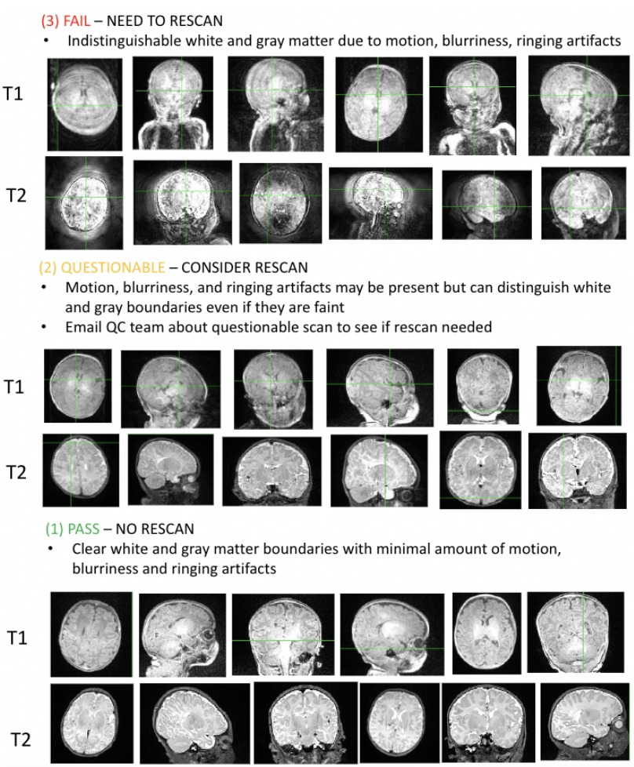

# Infant Preprocessing

**Structural Pre-Processing Quality Assessment of BIDS Input Data**

Before processing infant data, the structural input data needs to be checked to ensure that it is high quality enough to process successfully. There are three "grades" that could be given to images, examples of each are shown below. 

For questions, suggestions, or to note any errors, post an issue on our [Github](https://github.com/DCAN-Labs/cdni-brain/issues).