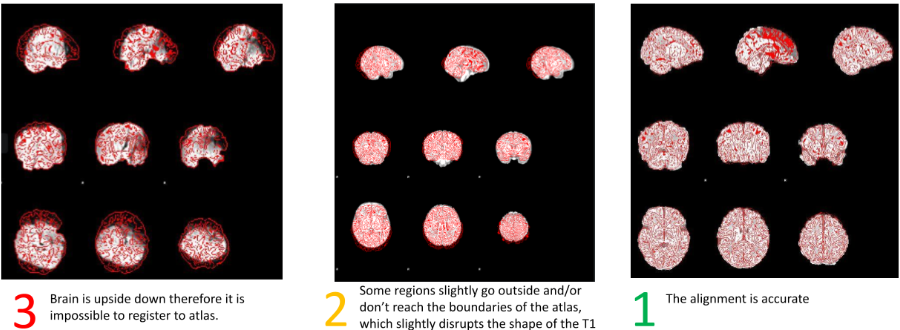

## Post-Processing Quality Assessment from Executive Summary

After processing infant data, the executive summary images can be used to spot issues/errors in the pipeline.

There are three modes of quality checking neonate neuroimaging data with specific areas to check:

- Executive Summary Overview

    - T1 & T2 surface evaluation with Brain Sprite

    - Functional Scan Images
     
    - Reference Frame

    - Motion Numbers and Grayordinates

- Structural Quality Assessment

    - T1 to Atlas registration- outside of executive summary folder

    - T1 & T2 grey and white matter surface delineation

- Functional Quality Assessment

    - BOLD alignment to T1 - either in executive summary or outside in the `img` folder

The path to the executive summary files from a subject folder should follow this pattern:

`/processed/<STUDY>/sub-<ID>/ses-<ID>/files/summary_DCANBOLDPROC_v4.0.0/executivesummary`

and should contain a .html file and an img folder

### Correct Executive Summary?

Score as 1 if the executive summar contains all the components it should: 

- T1 surfaces in brain sprite
- T2 surfaces in brain sprite
- Functional data
- Combined resting states' grayordinates and motion numbers pre- and post-regression

Score as 0 if something is missing and make a note of what is missing 

**Structural Data**

**Brain Sprite Artifact**

For some subjects, there are some frames of the T1 that appear green or purple. This **is not an artifact of the T1** but an unknown error from compiling the frames of the T1 into Brain Sprite. This has nothing to do with the quality of the scan and should be ignored.

### Structural QA

We are looking for if the surfaces delineate gray and white matter. Common errors to look for to determine this are:

- Blurriness
- Ringing
- Sawtooth Jags
- Surfaces containing skull or dura

The presence of these errors doesn't automatically indicate the images are poor quality, it's to what extent these errors disrupt the delineation of the gray and white matter.

- If errors persists in a particular region but is properly delineated after 

    - 1-10 frames: QA = 1
    - over 10 frames: QA = 2 

- If errors persist throughout the brain making it indistringuishable to delinates or doesn't caputre a particular region,

    - QA = 3

Here is the QA scale used for structural images

**Atlas Registration**

In the executive summary folder, there are 2 images to QA within the img folder: the T1 and atlas overlaid onto each other. 

- Whichever image preceds the word "in" will be overlaid in red onto the other image, i.e `atlas in t1` has the atlas overlaid in red over the T1.

How well the T1 aligns with the atlas will signify the quality of atlas registration after processing 

- This is also useful in identifying any T1 distortions that will affect the structural and functional quality 

- Look at how well the T1 aligns with the inner boundry of the atlas

- The best way to evaluate the registration is by going back and forth between the 2 overlaid images 

**General Guidelines**

In the executive summary folder, open the .html file and go through each of the places the view the segmented T1 and T2 to check if the surfaces delineate the gray and white matter 

When assessing the delineation, there are two regions the disregard:

- Subcortical regions (circled in pink) between the temporal lobes in the coronal view

    - The HCP pipeline specifies subcoritcal regions through a separate process so QA is only concerned with cortical region deliniation

- Midline (circiled in purple) in the axial and coronal view 

Blurriness happens when there are small movements in the small or from partial volumes (one voxel captures mutliple tissues types)

Ringing (striations/stripy-ness) is the result of systemative motion by the subject and can be problematic because it can disrupt the ability to delineate surfaces since the segmentation will follow the ringing artifact 

Sawtooth jags are artifacts that indicate motion but their presence in one frame **doesn't** automatically indicate low image quality. They signal that subsequent frames need to be observed to see if it dissipates. They are less common in infants than adolescents.

Sometimes surfaces will capture non-brain tissue, like dura matter or skull. When this happens, QA is based on to what extend the non-brain tissue disrupts the delineation.

- When surface goes into non-brain tissue throughout the brain but surfaces are otherwise well delineated: QA = 2

- If non-brain tissue disrupts surface delineations: QA = 3 

Overlap occurs when white matter and gray matter surfaces cross over one another. If this error is corrected in:

- 1-10 frames: QC = 2
- over 10 frames, throughout the brain, or corsses more than one boundry: QC = 3

### Functional QA

If functional data isn't in the executive summary, use the `eog` command to view the following files in the img folder:

`sub-ID_ses-ID_task-rest_run-01_desc-T1InTask.gif` and `sub-ID_ses-ID_task-rest_run-01_desc-TaskInT1.gif`

The goal is to examine how well the resting state functional data aligns to the structural T1 data. Common errors to look for this goal:

- Field of view cut-offs (appears as cerebellum/occipital dropout)
- Signal dropout (common in frontal, temporal, and superior parietal regions)

Just as with structural QA, the prescence of these errors don't automatically inidcate poor quality, it's to what extent these errors disrupt the alignment of the structural and functional data. 

Here is the QA scale

Below are example images and their scoring 

### QA Spreadsheet

Here is an example of a filled-in QA spreadsheet 

The QA spreadsheet you will fill out is organized a bit differently than the filled-in example 

**Things to note:**

- Column 2 indicates if firefox of chromium-browser should be used to open to executive summary .html file 

- Some subjects have wonky file names so the REST# columns are used to list file names that shouhld be opened to QA functional to structural registrations for those subjects