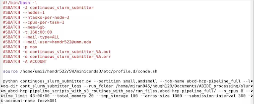

# Job Submissions

24. If an sbatch job is running for >3 minutes, there are most likely no errors in the run command, and job doesn't not need to be closely monitored before completion 

25. If a submission is above 2000 jobs (slurm’s max in-queue number of jobs), use the continuous submitter.

    * Path to continuous submitter: `/home/faird/shared/code/internal/utilities/slurm_pipeline_wrappers/continuous_slurm_array_submitter`

    * Below is an example of what the submitter script will look like:

    

26. Check the [fairshare](#5-fairshare) to know which account to use for processing.

27. Make sure a ton of jobs aren’t failing right away. Permissions errors, job set up issues, and data issues are common causes.