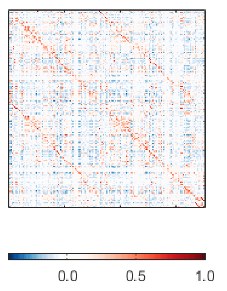
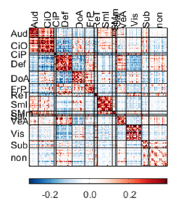
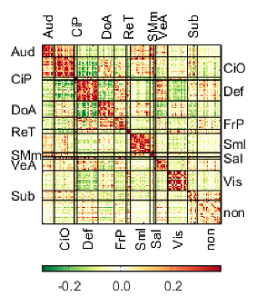
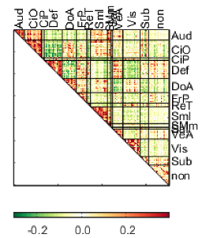
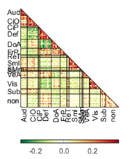

# Connectivity Matrices

This code visualizes conntecivity matrices. The most basic functionality is to only display a 2D matrix. If you provide extra (optional) arguments, you can group connectivity values per fuinctional system and mess with the coloring schema and visualization ranges. All code and documentation originally developed by Oscar Miranda-Dominguez. The code can be found at `/home/miran045/shared/code/internal/utilities/plotting-tools/showM/`. Expanded documentation (which includes more example pictures for all of the arugments and the 3 special functions) can be found in the `html` subdirectory of the same directory. 

## Inputs

**Required**

There is only one required input to the showM function, a connectivity matrix of the size ROIxROI (M): `showM(M)`

**Optional**

There are several optional arguments that can be used to change the appearance of the plot. These are provided to the function as paired arguements with the format "name,value".

`'clims',[min, max]`

- This argument limits the range of values on the plot. If not specified, the code will use the min and max of M as its limits

`'parcel',Value`

- This argument allows you to define the assignment of each ROI to a functional system. "Value" must be a structure with a size of the number of functional systems and needs to contain the name and indices assigned to each functional system as fields. 

`'one_side_labels',Value`

- This argument allows you to indicate if you want the functional system labels on one or both sides of the matrix. "Value" is either 1 or 0. Default is 0 (only on one side). Use 1 to have labels on both sides.

`'line_width',Value`

- This argument is the line width for the dividers. "Value" should be a number. Default is 1.

`'line_width',Value`

- This argument is the color for the divider lines. "Value" is a vector with 3 elements of the RGD values of the color to be used. Default is white ([1 1 1])

`'show_dividers',Value`

- This argument indicates if you want lines displayed to separate functional systems. "Value" is either 1 or 0. Default is 1 (show lines)

`'my_color',Value`

- This argument is the color schema for the matrix. "Value" only has three available options, red-blue (`RB`), red-yellow-blue (`RYB`), or red-green (`RG`). If you want another schema, you can force jet, parula, or any other MATLAB schema. Default is RB


## Example Plots

The most basic command you can use is `showM(matrix)` which will output something like this:



Below are some examples of commands that use a lot of optional arguments and what types of matrices they produce.

```
 showM(M,...
    'parcel',parcel,...
    'line_color',[0 0 0],...
    'line_width',0.5,...
    'clims',[-.3 .39],...
    'fs_axis',10,...
    'fig_wide',7,...
    'one_side_labels',1,...
    'fig_tall',8);
```



```
 showM(M,...
    'parcel',parcel,...
    'line_color',[0 0 0],...
    'line_width',0.5,...
    'my_color','RG',...
    'clims',[-.3 .39],...
    'half','both');
```



```
 showM(M,...
    'parcel',parcel,...
    'line_color',[0 0 0],...
    'line_width',0.5,...
    'my_color','RG',...
    'clims',[-.3 .39],...
    'half','up');
```



```
 showM(M,...
    'parcel',parcel,...
    'line_color',[0 0 0],...
    'line_width',0.5,...
    'my_color','RG',...
    'clims',[-.3 .39],...
    'one_side_labels',1,...
    'half','low');
```



## Showing only a few networks

If you would like to show data only from a few netowrks, you need to make a new parcel object that only includes the networks you care about. For example, if you only care about the motor, subcortical, and default networks, those systems in the provided structure parcel have indicies of 8, 9, 13, and 4. The compantion function and following code might help to perform this. 

```
n_systems=size(parcel,2);   % count the number of functional systems in the object parcel
ix_networks_to_keep=[8 9 13 4];     % indices to keep
ix_networks_to_remove=get_ix_networks_to_remove(ix_networks_to_keep,n_systems);     % get the indices of the systems to remove

% calculate the new truncated parcel abject and the corresponding truncated
% matrix with the indices properly sorted
[newM, newParcel]=truncate_parcel_resort_matrix(M,parcel,ix_networks_to_remove);

% Calculate color limits excluding a delta of one on each tale
delta=1;
clims=get_ptiles_M(newM,delta);

% Define options for plotting
fig_wide=8;
fig_tall=9;
line_color=[1 1 1]*0;
one_side_labels=1;
half='low';
line_width=.01;
my_color='RB';

% Display the new matrix
showM(newM,'parcel',newParcel,...
    'clims',clims,...
    'fig_tall',fig_tall,...
    'fig_wide',fig_wide,...
    'line_color',line_color,...
    'one_side_labels',one_side_labels,...
    'half',half,...
    'my_color',my_color,...
    'line_width',line_width);
```

## Showing only specific systems

If you only want to show data from particular systems, you need to provide the list of pairs you care about. Building on the previous example, if you only want to show data from the Def-Def, Def-Sml, and Sub-SMm on the truncated parcel, you need to identify the indices and count the systems in the new parcel. Below is code showing how to do this.

```
n_systems=size(newParcel,2);

% Display the indices
[num2str([1:n_systems]') repmat(') ',n_systems,1) cat(1,char(newParcel.name)) repmat(', n = ',n_systems,1) num2str(cat(1,newParcel.n))]

% Report the indices
ix_parcel_pairs_on=[1 1; 2 3; 3 4];

showM(newM,'parcel',newParcel,...
    'clims',clims,...
    'fig_tall',fig_tall,...
    'fig_wide',fig_wide,...
    'line_color',line_color,...
    'one_side_labels',one_side_labels,...
    'half',half,...
    'my_color',my_color,...
    'line_width',line_width,...
    'IX_parcel_pairs_ON',ix_parcel_pairs_on);
```

```
ans =

  4×22 char array

    '1) Def        , n = 41'
    '2) Sml        , n = 38'
    '3) SMm        , n =  8'
    '4) Subcortical, n = 19'
```

## Color only specific systems

This function calculates color limits based on a parcel with the systems you want to highlight

```
clims=get_ptiles_M_from_pairs(newM,delta,newParcel,ix_parcel_pairs_on);
showM(newM,'parcel',newParcel,...
    'clims',clims,...
    'fig_tall',fig_tall,...
    'fig_wide',fig_wide,...
    'line_color',line_color,...
    'one_side_labels',one_side_labels,...
    'half',half,...
    'my_color',my_color,...
    'line_width',line_width,...
    'IX_parcel_pairs_ON',ix_parcel_pairs_on);
```


For questions, suggestions, or to note any errors, post an issue on our [Github](https://github.com/DCAN-Labs/cdni-brain/issues).