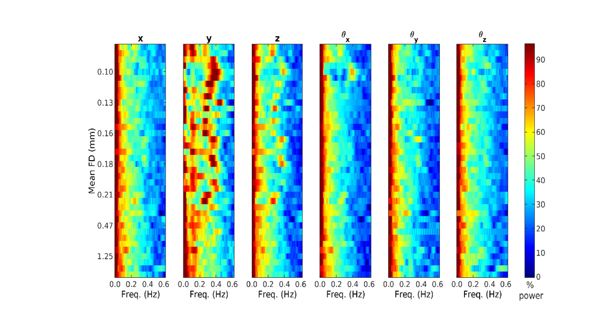

# Analyzing Motion Regressor 

Motion regression is performed on neuroimaging data to reduce motion-related artifacts in the signal. This method focuses on using MATLAB scripts to process the regressor files and identify motion artifacts related to respiration. More information about the scripts can be found on the [Github repo.](https://github.com/DCAN-Labs/movement_regressors_power_plots)

**NOTE:** If you are trying to use this analysis on fmriprep/nibabies outputs, you will need to save your working directory to find the movement regressor files. 

## Step 1: Cloning the Repository

Clone the repository by running: 

```
git clone https://github.com/DCAN-Labs/movement_regressors_power_plots/
```

## Step 2: Determine Your TR (Repetition Time)

Check the NIfTI headers to find the TR value, which represents the time between succesive scans, it may vary depending on the data.

To find with fsl run: 
```
module load fsl
fslinfo sub-***_task-movieDM_bold.nii.gz
```

To find with workbrench run:
```
module load workbench
wb_command -file-information sub-***_task-movieDM_DM.bold.nii.gz
```

## Step 3: Locate Your Regressor Files 
    
If you used the ABCD-HCP pipeline, the regressor files would be located at: 

```
processed/abcd-hcp-pipeline/sub-ID/ses-{SESSION}/files/
```

If you used fmriprep or nibabies, they are located at:
```
work-dir/{pipeline}/sub-ID/ses-SESSION/{pipeline}_wf/single_subject_{ID}_wf/func_preproc_ses_{SESSION _task_rest_acq_noNORDIC_run_1_echo_1_wf/bold_hmc_wf/normalize_motion/motion_params.txt
 ```
The pipeline should be replaced with the relevant pipeline.

For instance, if you're using resting state, select the task-based resting state directories and locate the "Movement_Regressors.txt" files in each run.

Each run should have a separate regressor file. If you are working with resting-state data, use only the regressor files related to resting-state scans.
    
Copy all regressor files and rename them based on their run number, task name and sub ID, putting them all in one directory.

## Step 4: Choose the Appropriate Version

In the repository, you will find three versions (ver1, ver2, ver3) for processing the data. Visually inspect your regression files and compare them with the regressor files available in each version folder to identify the most suitable one. For instance, if you notice that the number of rows and columns aligns with ver1, specify ver1 in your script. Additionally, running the provided script should display motion artifacts primarily on the y-axis with a low hertz (Hz) value, representing respiration. This information will help you choose the correct version.


## Step 5: Create a New MATLAB Script

- Begin a new MATLAB script and include the provided code snippet. Ensure that you modify the script by replacing placeholders with your actual paths. 

- Replace 'your directory for cloning movement_regressors_power_plots' with the path where you cloned the repository. 

- Similarly, update 'This is the directory you have your regressor files' with the correct path to your regressor files.

```
% Step 1: add path
path_code = '/path to cloned directory movement_regressors_power_plots';
addpath(genpath(path_code));

% Step 2: Set TR (Repetition Time) and version
f = filesep;
TR = 0.8; % TR in seconds
ver = 1;

% Step 3: Specify the directory with your regressor files
input_regressor = 'your full directory to regressor files';
regressor_paths = dir(input_regressor);

% Step 4: Create a cell matrix to store regressor file paths
paths = cell(length(regressor_paths) - 2, 1);
for regressor_file = 1:length(paths)
    paths(regressor_file) = {strcat(regressor_paths(regressor_file + 2).folder, f, regressor_paths(regressor_file + 2).name)};
end

% Step 5: Call the function 'cat_mov_reg_power' 
[CLIM, ix_subject_scan, MU, SIGMA, P] = cat_mov_reg_power(paths, TR);

% Note: The processed data is now available in the variables: CLIM, ix_subject_scan, MU, SIGMA, and P.
```



## Step 6: Process the Regressor Files:
Run the MATLAB script to process the regressor files using the chosen version. This step will calculate certain metrics like CLIM, ix_subject_scan, MU, SIGMA, and P.

## Step 7: Identify Motion Artifacts Related to Respiration:
Debugging with Breakpoints with seting breakpoints in the code to pause the execution at specific lines and inspect the variables at that point.

Debugging Variables: You used the MATLAB debugger to check the values of variables like "x" and "y" at different stages of the code.

Open the function 'cat_mov_reg_power' and set a breakpoint on line 267. 
Rerun the last line of the script [CLIM, ix_subject_scan, MU, SIGMA, P] = cat_mov_reg_power(paths, TR) to view the data in your terminal.

## Step 8: Determine Respiration Peaks:
In the terminal, use the provided commands to identify the peaks related to respiration. 
You can use the following function [available in 04_to_run_aliased_RR] to calculate the respiration rate based on the aliased frequencies.
```
RR_bpm=12:3:30;% respiration rate (RR_bpm)in breaths per minute
TR=0.8; % TR in seconds
[T,RRa_Hz] = aliased_RR(RR_bpm,TR);
```
Considering the identified respiration rate, determine a suitable range to filter motions. 

```
%output
Aliased frequencies at a TR of 0.8 seconds
    Resp_rate_bpm    Resp_rate_Hz    Resp_rate_aliased_Hz
    _____________    ____________    ____________________

        12.0            0.200               0.2000       
        15.0            0.250               0.2500       
        18.0            0.300               0.3000       
        21.0            0.350               0.3500       
        24.0            0.400               0.4000       
        27.0            0.450               0.4500       
        30.0            0.500               0.5000   
```

## Step 9: Filter Motions:

In this example, a bandstop filter ranging from 12 to 27 Hz was selected due to our motion threshold being set at 0.45.

```
peaks = max(Y, [], 2);
open peaks
[~, peaks] = max(Y, [], 2);
x(peaks)    
max(x(peaks))
%  0.4517
```
## Step 10: Modify pipeline

Modify the bindings flag accordingly to filter the motion artifacts in your pipeline template.
Here is an example:

```
# run abcd-hcp-pipeline
env -i ${singularity} run \
-B ${data_dir}/:/bids_dir \
-B ${data_dir}/processed/abcd-hcp-pipeline/:/output_dir \
-B ${run_dir}/license.txt:/opt/freesurfer/license.txt \
/home/faird/shared/code/internal/pipelines/ABCD-BIDS/abcd-hcp-pipeline_v0.1.3.sif \
/bids_dir /output_dir \
--bandstop 12 27 \   %here we add our flag for motion filter
--freesurfer-license=/opt/freesurfer/license.txt \
--participant-label ${subj_id} \
--stages "PreFreeSurfer:CustomClean" \
--custom-clean HCP-D_BIDS_cleaning.json \
--ncpus ${cpu_usage}
```