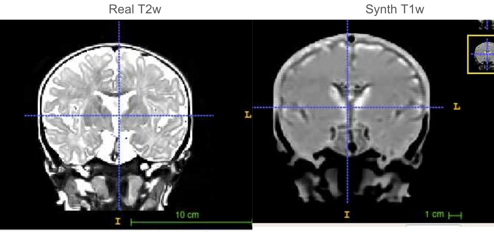

<center>

# Using [MR-Image-Translation](https://github.com/DCAN-Labs/MR-Image-Translation) to generate synthetic anatomicals from trained models
Documentation by Paul Reiners and Lucille A. Moore to supplement information provided in GitHub repository (forked from [perronea/MR-Image-Translation](https://github.com/perronea/MR-Image-Translation))

</center>


### Background
This utility generates synthetic images of the opposite modality from T1w or T2w anatomicals for skull-on neonatal data. The synthetic images are fairly low-quality due to the fact that generating synthetic images is much easier with skull-stripped images than skull-on. Here is an example result that is fairly standard that demonstrates how the synthetic image lacks distinction between gray and white matter:



However, if someone does wish to use this utility on MSI, this documentation will help you do so.

### Environment and System Setup
Required python package versions are saved in requirements.txt and should be installed within a virtual environment (see [README](https://github.com/perronea/MR-Image-Translation/blob/main/CycleGAN/README.md#system-setup)).
The MR-Image-Translation code will run on Python 3.6.  It may run on other versions as well.  
If you simply wish to run it and not do any development work, then you should simply use Python 3.6.  

If you are doing development work, then you should consider using the latest stable version of Python.  You may have to make some changes because APIs have changed, but it will make things easier for future developers.
The latest version of this project is [v1.0.1.](https://github.com/DCAN-Labs/MR-Image-Translation/releases/tag/v1.0.1)

If you clone this project from GitHub and then change your directory to the new cloned directory, the commands below will give you a working Python environment.

```
cd CycleGAN
python3 -m venv env
source env/bin/activate
pip install -r requirements.txt
```
If you run into problems or have questions, please contact [Paul Reiners](reine097@umn.deu).


### Image preprocessing
Anders has models available for use to generate both synthetic T1ws from real T2ws and synthetic T2ws from real T1ws. The data he used for training (the ECHO infant dataset) underwent some minimal image preprocessing that must be performed on your input data as well, including (1) fslreorient2std, (2) ACPC alignment (from DCAN-infant-pipeline), (3) ANTS DenoiseImage, and (4) bias field correction with N4BiasFieldCorrection. Image preprocessing is performed by [setup_input_image.sh](https://github.com/perronea/MR-Image-Translation/blob/main/UNet/code/setup_input_image.sh).

We’ve added some additional helper scripts to perform image preprocessing under [MSI_preprocessing_scripts](https://github.com/DCAN-Labs/MR-Image-Translation/tree/MSI_preproc_additions/MSI_preprocessing_scripts) on the [MSI_preproc_additions](https://github.com/DCAN-Labs/MR-Image-Translation/tree/MSI_preproc_additions) branch of DCAN’s forked repo. 

#### To use these scripts:
Update the paths at the top of preproc.py and update the resources as needed in the preproc.sh sbatch script. preproc.py sbatches preproc.sh for each input file it finds in your working directory and preproc.sh then runs setup_input_image.sh to perform preprocessing.

Once the images are preprocessed, you also need to make sure that they have the prior image dimensions of 156 X 182 X 156 to match the data that the models were trained on. If your input data has larger dimensions than this and you’re able to crop the image such that the brain isn’t cropped, then you can use the script crop_image.py to crop your images to the correct size. Edit the script with the correct file paths for input and output directories and specify the the minimum and maximum dimensions for the x, y, and z planes (to do this, you will need to pull the image up in an image viewer and determine these dimensions manually)

If using crop_image.py will result in overcropping of your images, then you can check out [resize_image.py](https://github.com/DCAN-Labs/dcan-nn-unet/blob/main/dcan/img_processing/resize_images.py) in the dcan-nn-unet repo for an alternative approach to adjust the image dimensions.
### Working Directory Setup
#### Put models in directory:
```
./models/
```
With names:

```
G_A2B_model.hdf5
G_B2A_model.hdf5
```
Create directories for generated images:

All images must be of size (156, 182, 156).

```
./generate_images/synthetic_images/A
./generate_images/synthetic_images/B
```
Comment row 242:
```
#self.train(…
```
Uncomment row 243:
```
self.load_model_and_generate_synthetic_images()
```
Put input data in:

- CycleGAN/data/MR_crop/testA
- CycleGAN/data/MR_crop/testB
### Execution to generate synthetic images
Run from the CycleGAN folder.

```
python CycleGAN_3D.py
```


For questions, suggestions, or to note any errors, post an issue on our [Github](https://github.com/DCAN-Labs/cdni-brain/issues).