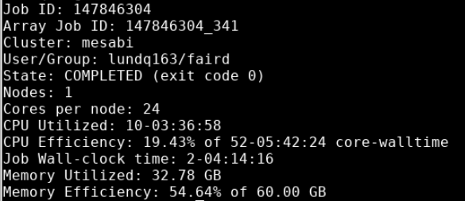

# Optimizing SBATCH parameters 

In order to create a sbatch for a script, you need to know how many resources the job will need to run. To get an estimate, you can run just a few subjects to get an idea of how much resources a single subject uses. We also have guidelines for how many resources each pipeline needs. 

21. Run a few subjects with the pipeline. You can use the same 3-5 jobs you used for [storage estimates](storage.md) to estimate job specifications.

22. Run `seff` on the jobs 

    - `seff` is used to check the memory utilization and CPU efficiency for completed jobs. Note that for running and failed jobs, the efficiency numbers reported by `seff` are not reliable so please use this tool only for successfully completed jobs.

    - The job ID can be found first by using  `squeue -al –me` , and it will be the number associated with the most recent job submission listed under “JOBID”   

        - Use `sacct -S YYYY-MM-DD -u x500` to find job IDs for past jobs that occurred after the specified start date.

    - Command to run: `seff job_id`

    - CPU Efficiency is calculated as the ratio of the actual core time from all cores divided by the number of cores requested divided by the run time.

    - Memory Efficiency is calculated as the ratio of the maximum amount of RAM used by all tasks divided by the memory requested for the job.

    - `seff` output example:

        

        - *Nodes* can be manipulated in the sbatch by the `--nodes` flag. 

        - *Cores per node* can be manipulated with the `--ntasks-per-node` flag. 

        - _Job Wall-clock time_ is the length of the job in real hours, and can be manipulated with the `-t` or `--time` flags. Based on this output, a time specification of `72:00:00` should suffice. 

        - *Memory Utilized* can be manipulated with the `--mem` flag. Based on this output, a 40 GB specification of memory will allow for a more efficient job versus 60 GB. 
        
        - *CPU Utilized* is the total CPU hours that were allocated based on the request.
        
        - _CPU Efficiency_ is the proportion of the CPU that was utilized for the job compared to the total core-walltime of the CPU.

