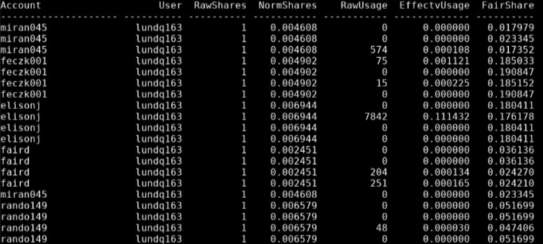

# Optimizing Job Submissions

In order to create a sbatch for a script, you need to know how many resources the job will need to run. To get an estimate, you can run a few subjects to get an idea of how much resources a single subject uses. We also have [pipeline-specific resource guidelines](pipelines.md). The account you select for running a job also matters, as some accounts will queue faster than others depending on their usage. It is important to optimize the resources for your job so they queue as fast as possible and don't spend days/weeks sitting stagnant in the queue. 

## seff

1. Run a few subjects with the pipeline. You can use the same 3-5 jobs you used for [storage estimates](storage.md) to estimate job specifications. Keep track of the job ID when you submit them. 

2. Run `seff` on the jobs with the command `seff job_id`

    - `seff` is used to check the memory utilization and CPU efficiency for completed jobs. Note that for running and failed jobs, the efficiency numbers reported by `seff` are not reliable so please use this tool only for successfully completed jobs.

        - Use `sacct -S YYYY-MM-DD -u x500` to find job IDs for past jobs that occurred after the specified start date. See more information on the [SLURM Commands page.](slurm.md#job-status)

    - CPU Efficiency is calculated as the ratio of the actual core time from all cores divided by the number of cores requested divided by the run time.

    - Memory Efficiency is calculated as the ratio of the maximum amount of RAM used by all tasks divided by the memory requested for the job.

    - `seff` output example:

        

        - _Job Wall-clock time_ is the length of the job in real hours. Based on this output, a time specification of `72:00:00` should suffice. 

        - *Memory Utilized* is the amount of memory used. Based on this output, a 40 GB specification of memory will allow for a more efficient job versus 60 GB. 
        
        - *CPU Utilized* is the total CPU hours that were allocated based on the request.
        
        - _CPU Efficiency_ is the proportion of the CPU that was utilized for the job compared to the total core-walltime of the CPU.

        - To change these specifications, see the sbatch parameters on the [SLURM Commands page.](slurm.md#job-parameters)

## Storage

When you're submitting a job that produces output files, you need to consider where those outputs will be stored (i.e. tier1 vs s3 and on which share). See [the Data Storage page](storage.md) for more information about where and how to store your outputs. Remember, **DO NOT** store ABCC/ABCD data on the `faird` share. 

## Fairshare

Read: [HPC Fairshare scheduling @ MSI](https://www.msi.umn.edu/content/hpc)

The goal of fairshare is to increase the priority when scheduling jobs. When a group has recently used a large amount of resources, the priorities of their waiting jobs will be negatively affected until their usage decreases.

`sshare -U`: checks all of the accounts a user has access to at once

   * Below is an example of a terminal output after running the above command:
   * Based on the values in the `FairShare` column, the larger numbers will receive higher priority when running jobs. So with the below output, the user would want to submit jobs using `feczk001`.



For checking the fairshare of a specific account, use `sshare --account=$account_name -a`: $account_name is the group account that you want to check the fairshare of. The group account names are: **miran045**, **faird**, **feczk001**, **rando149**, plus any additional shares you have access to, like **smnelson**, **btervocl**, or **bart**. 

* The number within the `FairShare` column is a fraction of the total fairshare remaining, with larger numbers meaning a higher priority and smaller numbers meaning a lower priority 
* For more detail, [watch this fairshare tutorial.](https://www.youtube.com/watch?v=uKeMHDo1BkM).

## Optimizing Your SLURM Queue

These tips can be applied to ANY type of job. You don't have to use all of them every time, but it is advisable to use all of them whenever you're submitting a lot of jobs or a few resource intensive jobs. They can prevent your jobs from sitting in queue for days or weeks on end. The more you've tailored your job parameters to fit the job you are running (by using the above recommendations), the quicker you will queue.

**Partition Choice**

- Choose a partition based on your SBATCH parameters.

- Choose as many partitions that fit your partitions, the more the merrier. Below is an example of selecting multiple paritions

```
#SBATCH -p small,amdsmall,amd512,ram256g
```

**Spread Out Your Jobs**

- Submit groups of jobs on different accounts and clusters.

    - Although you can't specify multiple accounts, you can split your jobs into groups and submit each group with a different account and/or cluster.

    - Remember if you're submitting on a different cluster, you have to make sure the partition you choose matches the new cluster. 

    - Use the fairshare values to determine how many accounts you want to split your job between.

    - If you submit the job then then end up sitting stagnant in the queue for more than a few days, use [scontrol commands](slurm.md#job-status) to change the resources. 

- Have different people submit jobs for you.


For questions, suggestions, or to note any errors, [post a Github issue](https://github.com/DCAN-Labs/cdni-brain/issues).