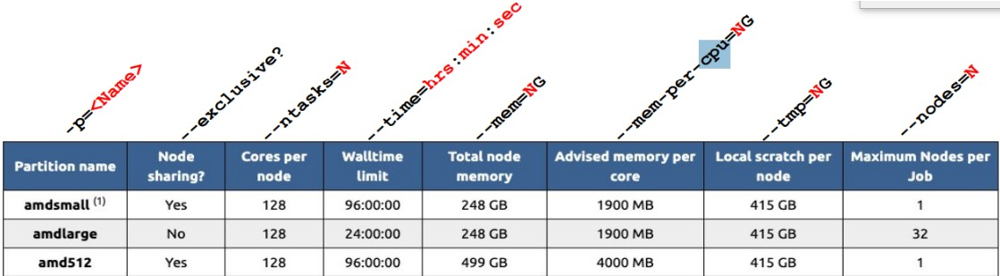

# Partitions

Read:  [Partitions @ MSI](https://www.msi.umn.edu/partitions)

Each partition you may choose is specific to the HPC resource that is being used. 

In the table linked above, **"Partition name"** specifies the string for the partition. Note that some partitions are only accessible if connected to a corresponding login node, e.g. **ahXXXX** for Agate. “Federated” partitions such as **msismall** can be used from any login node, and automatically delegate jobs to a partition accessible via the current login node. 

**“Node sharing”** specifies whether a partition allows for multiple jobs to be allocated on the same node across resources.

**“Cores per node”** specifies the range of core processors that may be allocated for one job per node. 

**“Walltime limit”** specifies the maximum amount of time that is allocated for a job to use resources. 

**“Total node memory”** is the range of memory allocated for each node. 

**“Advised memory per core”** is effectively the amount of RAM allocated to a given CPU. 

**“Local scratch per node”** is the total amount of --tmp storage that you can specify for that partition. 

Finally, **“Maximum nodes per job”** is the highest number of nodes one may be allocated for each job.
