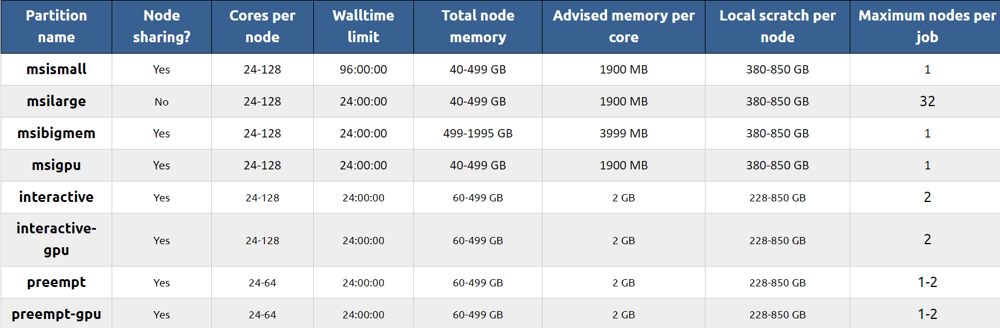

# Nodes and Partitions

## Nodes

**Login nodes** (e.g. `ah0123` or `ln4567`) have access to fewer resources than **compute** (aka **interactive**) nodes. Login nodes are good for file browsing, text editing, small file transfers, and other minimal tasks. Any command taking longer than 15 minutes to run will be killed. To login to a compute node (e.g. `cn0123` or `acn4567`), run `ssh -Y agate` or 'ssh -Y mangi'. You will be prompted to authenticate with Duo. 

**sbatch** jobs can be submitted on login or compute nodes. **sruns** can only be requested on a compute node. Read more about sbatch and srun jobs [here.](slurm-params.md) 

If you try to submit a job on a partition that doesn't have access to the amount of resources you requested or that can't be accessed from your current node, the job submission will fail and throw an error. MSI has two HPC clusters (agate, mangi) to use for submitting jobs.  Check [this site](https://status.msi.umn.edu/) for the status of the clusters. Agate has several **partition** options. 

## Partitions 

Read:  [Partitions @ MSI](https://www.msi.umn.edu/partitions)

Partitions manage different sets of hardware and have different limits for computing resources. 

Each partition you may choose is specific to the HPC resource that is being used, so you will nee to make sure that the partitions you request is either a part of the cluster you are submitting from or a **federated partition**. Federated partitions (e.g. **msismall**) automatically delegate jobs to a partition that is accessible no matter the node you are on.

When [submitting jobs to slurm](slurm.md), it is important to consider which paritions are best for your job. [This section](optimizing.md) will help you get started with determining the optimal resources for a job. 

## Partition Resources

**"Partition name"** (`-p=name`) specifies the string for the partition. Note that some partitions are only accessible if connected to a corresponding node, e.g. **ahXXXX** for Agate. You can also list multiple partitions. 

**“Node sharing?”** specifies whether a partition allows for multiple jobs to be allocated on the same node across resources. The `--exclusive` flag will prevent the node from being shared with other jobs/users. 

**“Cores per node”** (`--ntasks=N`) specifies the range of core processors that may be allocated for one job per node. 

**“Walltime limit”** (`--time=hrs:min:sec`) specifies the maximum amount of time that is allocated for a job to use resources. 

**“Total node memory”** (`--mem=NG`) is the range of memory allocated for each node (in GB). 

**“Advised memory per core”** (`--mem-per-cpu=NG`) is effectively the amount of [RAM (Random Access Memory)](https://www.howtogeek.com/697659/what-is-ram-everything-you-need-to-know/) allocated to a given [CPU (Central Processing Unit)](https://www.freecodecamp.org/news/what-is-cpu-meaning-definition-and-what-cpu-stands-for/). 

**“Local scratch per node”** (`--tmp`) is the total amount of temporary storage that you can specify for that partition. 

**“Maximum nodes per job”** (`--nodes=N`) is the highest number of nodes one may be allocated for each job.

For questions, suggestions, or to note any errors, post an issue on our [Github](https://github.com/DCAN-Labs/cdni-brain/issues).
