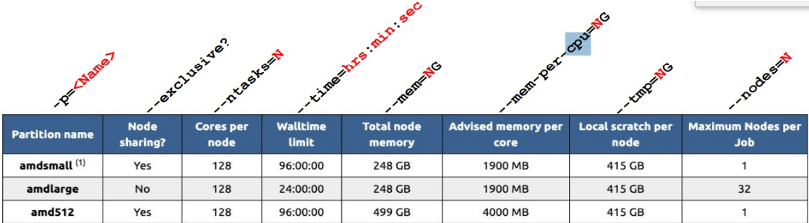

# Nodes and Partitions

## Nodes

Login nodes information can be found on MSI [Read: Login Nodes](https://userdocs.msi.umn.edu/compute/cluster_info.html).

To login to a login node from your local terminal, run `ssh -Y <cluster>` (e.g. `ssh -Y agate`). You will be prompted to authenticate with Duo. 

**sbatch** jobs can be submitted on login or compute nodes. **sruns** can only be requested on a login node. We describe sbatch and srun jobs in more detail on our [Slurm Jobs page.](slurm-params.md) 

## Partitions 

To learn more about partitions and their usage on MSI please see: [Read: Partitions](https://www.msi.umn.edu/partitions)

Note: Now that MSI has retired the old Mesabi cluster and collapsed the Mangi nodes onto the Agate cluster, all partitions should be available to you when requesting resources.

When submitting jobs to SLURM, it is important to consider which paritions are best for your job. [Our resource optimization section](optimizing.md) will help you get started with determining the optimal resources for a job.

## Partition Resources

* Please note that the partition names in this image no longer exist but this logic still applies.

**"Partition name"** (`-p=name`) specifies the string for the partition. You can list multiple partitions. 

**“Node sharing?”** specifies whether a partition allows for multiple jobs to be allocated on the same node across resources. The `--exclusive` flag will prevent the node from being shared with other jobs/users. 

**“Cores per node”** (`--ntasks=N`) specifies the range of core processors that may be allocated for one job per node. 

**“Walltime limit”** (`--time=hrs:min:sec`) specifies the maximum amount of time that is allocated for a job to use resources. 

**“Total node memory”** (`--mem=NG`) is the range of memory allocated for each node (in GB). 

**“Advised memory per core”** (`--mem-per-cpu=NG`) is effectively the amount of [RAM (Random Access Memory)](https://www.howtogeek.com/697659/what-is-ram-everything-you-need-to-know/) allocated to a given [CPU (Central Processing Unit)](https://www.freecodecamp.org/news/what-is-cpu-meaning-definition-and-what-cpu-stands-for/). 

**“Local scratch per node”** (`--tmp`) is the total amount of temporary storage that you can specify for that partition. 

**“Maximum nodes per job”** (`--nodes=N`) is the highest number of nodes one may be allocated for each job.

For questions, suggestions, or to note any errors, [post a Github issue](https://github.com/DCAN-Labs/cdni-brain/issues).
