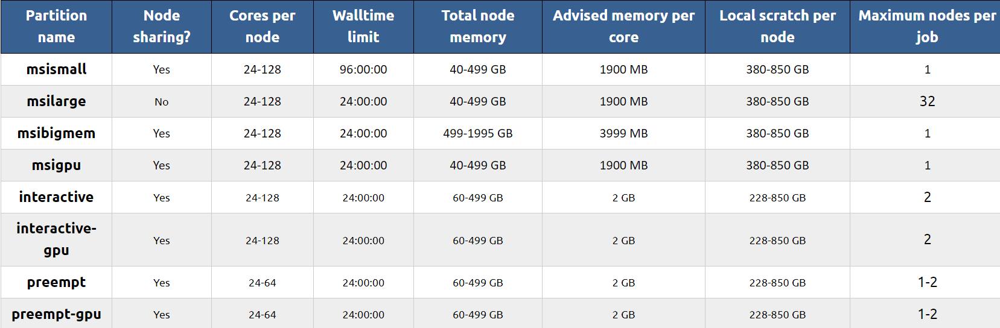

# Nodes and Partitions

## Nodes

MSI uses login nodes as the entry point for accessing compute resources, navigating files, transferring data, and interacting with the Slurm scheduler. Computationally intensive work should be performed on compute nodes rather than directly on login nodes.

For current information about login nodes, compute nodes, usage limits, and appropriate tasks for each, see the [MSI Compute Need to Know documentation](https://userdocs.msi.umn.edu/compute/cluster_info.html).

For CDNI-specific guidance on submitting `sbatch` jobs and requesting interactive `srun` sessions, see our [Slurm Jobs page](slurm-params.md).

## Partitions

MSI uses Slurm partitions to organize jobs based on resource requirements such as CPU cores, memory, walltime, GPU availability, and node count. Different partitions have different hardware and resource limits.

For the current list of shared partitions, resource limits, and guidance on choosing the appropriate partition, see the [MSI Shared Partitions documentation](https://userdocs.msi.umn.edu/compute/shared_partitions.html).

MSI's current primary HPC system is Agate. Check the [MSI Status page](https://status.msi.umn.edu/) for current system availability and maintenance notices.

When submitting jobs to Slurm, it is important to choose a partition that matches the resources required by your job. [Our resource optimization section](slurm-params.md#resource-optimization) provides CDNI-specific guidance for estimating appropriate resource requests.

For general MSI guidance on choosing partitions and right-sizing jobs, see the [MSI Shared Partitions documentation](https://userdocs.msi.umn.edu/compute/shared_partitions.html).

## Partition Resources

Each MSI partition has its own resource limits, including available CPU cores, memory, walltime, GPUs, local scratch space, and maximum node counts. These limits may change as MSI hardware and scheduling policies are updated.

For the current partition names, hardware specifications, resource limits, and available GPU types, see the [MSI Shared Partitions documentation](https://userdocs.msi.umn.edu/compute/shared_partitions.html).

Common Slurm resource options include:

- `--partition` or `-p` to select a partition
- `--time` to request walltime
- `--mem` to request memory
- `--mem-per-cpu` to request memory per CPU
- `--nodes` to request a number of nodes
- `--ntasks` to request tasks or CPU resources
- `--tmp` to request local temporary storage
- `--gres` to request GPUs or other generic resources

For current Slurm job-script examples and submission guidance, see the [MSI Slurm Job Submission and Scheduling documentation](https://userdocs.msi.umn.edu/compute/slurm_job_submission.html).

**"Partition name"** (`-p=name`) specifies the string for the partition. You can list multiple partitions. 

**“Node sharing?”** specifies whether a partition allows for multiple jobs to be allocated on the same node across resources. The `--exclusive` flag will prevent the node from being shared with other jobs/users. 

**“Cores per node”** (`--ntasks=N`) specifies the range of core processors that may be allocated for one job per node. 

**“Walltime limit”** (`--time=hrs:min:sec`) specifies the maximum amount of time that is allocated for a job to use resources. 

**“Total node memory”** (`--mem=NG`) is the range of memory allocated for each node (in GB). 

**“Advised memory per core”** (`--mem-per-cpu=NG`) is effectively the amount of [RAM (Random Access Memory)](https://www.howtogeek.com/697659/what-is-ram-everything-you-need-to-know/) allocated to a given [CPU (Central Processing Unit)](https://www.freecodecamp.org/news/what-is-cpu-meaning-definition-and-what-cpu-stands-for/). 

**“Local scratch per node”** (`--tmp`) is the total amount of temporary storage that you can specify for that partition. 

**“Maximum nodes per job”** (`--nodes=N`) is the highest number of nodes one may be allocated for each job.

For questions, suggestions, or to note any errors, [post a Github issue](https://github.com/DCAN-Labs/cdni-brain/issues).
