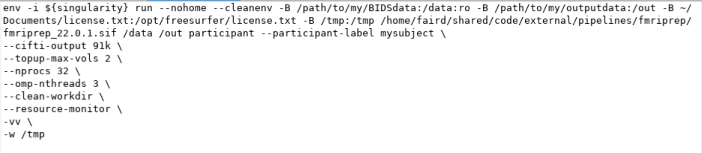
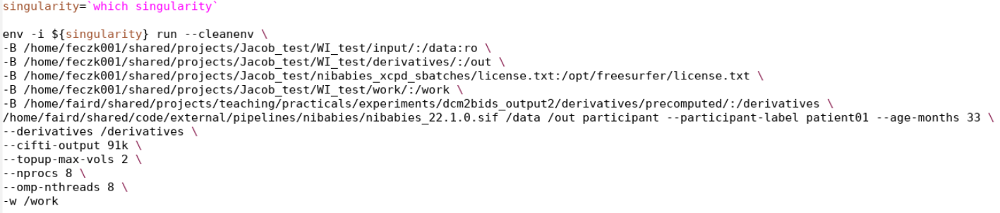
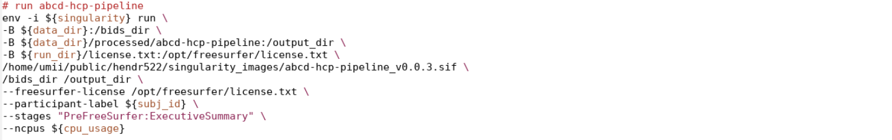
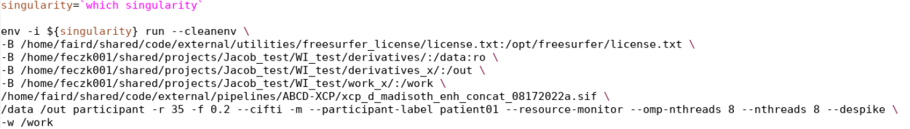
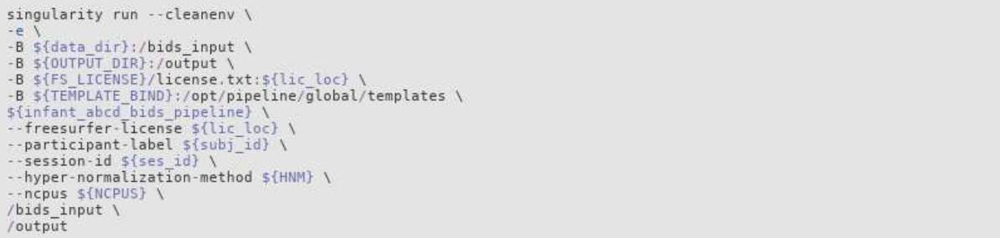

# Pipelines

<table>
  <tr>
   <td>
<strong>Infants</strong>
   </td>
   <td>Nibabies, DCAN Infant Pipeline, XCPD
   </td>
  </tr>
  <tr>
   <td><strong>Children (4 years and older) and Adults</strong>
   </td>
   <td>Fmriprep, abcd-bids pipeline, XCPD
   </td>
  </tr>
</table>

Note: the cutoff age for using an adult pipeline depends on the scope of the project

## 1. fMRIprep

Read: [fMRIPrep ReadTheDocs site](https://fmriprep.org/en/stable/)

A NiPreps (NeuroImaging PREProcessing toolS) application for the preprocessing of task-based and resting-state functional MRI (fMRI). For usage information, see [here](https://github.com/DCAN-Labs/fmriprep).

59. Preferred flags:

    * `--participant-label` \ : a space delimited list of participant identifiers or a single identifier (the sub- prefix can be removed)
    
    * `--cifti-output 91k \` : Possible choices: 91k, 170k. Output preprocessed BOLD as a CIFTI-dense time series. Optionally, the number of grayordinate can be specified (default is 91k, which equates to 2mm resolution). Default: False
    
    *  `--topup-max-vols 2 \` [**Deprecated as of 22.1.0]**: used to limit frames per run to use from PEPolar fmaps, useful when there are more than one pair of runs that have type _dir-AP _and _dir-PA_ in the /fmap directory to prevent topup distortion correction from taking excessively long. 
    
    * `--nprocs 32 \` : maximum number of threads across all processes **(if used, this should match the number of cpus allotted for your sbatch job)**
    
    * `--omp-nthreads 3 \` : maximum number of threads per-process
    
    * `--resource-monitor \` : enable Nipype’s resource monitoring to keep track of memory and CPU usage
    
    * `-vv \` : level 2 verbose log output, useful for troubleshooting
    
    * `-w /work` : used to specify a working directory within the same path as the sbatch, named_ /work_.

60. If an error is encountered, document it [here](https://docs.google.com/document/d/16qSEPV1_FHOHBq2eJOuZLqISv-0zCbpOJQ7HesEQCv4/edit#heading=h.13assk4h50o4). Also, see [Troubleshooting](troubleshooting.md#nibabies-and-fmriprep).

61. Example command:

    

## 2. NiBabies

Read: [NiBabies ReadTheDocs site](https://nibabies.readthedocs.io/en/latest/)

Nibabies is a robust pre-processing MRI and fMRI workflow that is also a part of the NiPreps family. NiBabies is designed and optimized for human infants between 0-2 years old. For more information on Nibabies code, see [here](https://github.com/nipreps/nibabies). For in-depth usage information, one can utilize [this google doc](https://docs.google.com/document/d/1PW8m1tWWqqgKCAJ9XLpJ5tycPB5gqFodrnvNOIavTAA/edit) or see the [Read the Docs here](https://nibabies.readthedocs.io/en/latest/installation.html).

62. Preferred flags:

    - `--participant-label \` : a space delimited list of participant identifiers or a single identifier (the sub- prefix can be removed)
    
    - `--age-months \`: used to specify the age in months of the participant that is being processed 
    
    - `--derivatives /derivatives \` : Nibabies will use a segmentation from the segmentation pipeline (pre-postBIBSnet). This flag is used to clarify that the precomputed segmentation directory is being utilized. 
    
    - `--cifti-output 91k \` : Possible choices: 91k, 170k. Output preprocessed BOLD as a CIFTI-dense time series. Optionally, the number of grayordinate can be specified (default is 91k, which equates to 2mm resolution). Default: False
    
    - `--topup-max-vols 2 \` [**Deprecated as of 22.2.0] **:used to limit frames per run to use from PEPolar fmaps, useful when there are more than one pair of runs that have type _dir-AP _and _dir-PA_ in the /fmap directory to prevent topup distortion correction from taking excessively long 
    
    - `-vv \` : level 2 verbose log output, useful for troubleshooting
    
    - `--nprocs 32 \` : maximum number of threads across all processes
    
    - `-`-omp-nthreads 3 \` : maximum number of threads per-process
    
    - `-w /work` : used to specify a working directory within the container’s filesystem, named _/work_.

63. If an error is encountered, document it [here](https://docs.google.com/document/d/16qSEPV1_FHOHBq2eJOuZLqISv-0zCbpOJQ7HesEQCv4/edit#heading=h.13assk4h50o4). Also, see [Troubleshooting](troubleshooting.md#nibabies-and-fmriprep).

64. Example command:

    

## 3. ABCD-BIDS

Read: [abcd-hcp-pipeline @ Github](https://github.com/DCAN-Labs/abcd-hcp-pipeline)

Read: [abcd-hcp-pipeline @ ABCC ReadTheDocs](https://collection3165.readthedocs.io/en/stable/pipeline/)

This pipeline provides an interface for processing BIDS-formatted MRI datasets using the DCAN-HCP pipeline and supporting modules including DCANBOLDProcessing and DCAN Executive Summary. For additional usage, see [here](https://github.com/DCAN-Labs/abcd-hcp-pipeline).

65. Preferred flags:
    
    - `--freesurfer-license \` : If using docker or singularity, you will need to acquire and provide your own FreeSurfer license. The license can be acquired by filling out[ this form](https://surfer.nmr.mgh.harvard.edu/registration.html).
    
    - `--participant-label \` : Optional list of participant IDs to run. Default is all IDs found under the BIDS input directory. The participant label does not include the "sub-" prefix
    
    - `--stages \` : Specify a subset of stages to run. Can be used to rerun some or all of the pipeline after completing it once, or resume an incomplete runthrough. If a single stage name is given, the pipeline will be started at that stage. If a string with a ":" is given, a stage name before the ":" will tell the pipeline where to start and a stage name after the ":" will tell it where to stop. If no ":" is found, the pipeline will start with the stage specified and run through ExecutiveSummary (or CustomClean/ABCDTask, if specified). Valid stage names: PreFreeSurfer, FreeSurfer, PostFreeSurfer, FMRIVolume, FMRISurface, DCANBOLDProcessing, ExecutiveSummary, CustomClean'
    
    - `--ncpus \` : Number of cores to use for concurrent processing and algorithmic speedups. Warning: causes ANTs and FreeSurfer to produce non-deterministic results.
    
    - `--custom-clean \` : Runs DCAN cleaning script after the pipeline completes successfully to delete pipeline outputs based on the file structure specified in the custom-clean JSON. Required for the custom clean stage.
    
    - `--bandstop \` : Parameters for motion regressor band-stop filter. It is recommended for the boundaries to match the inter-quartile range for participant group respiratory rate (breaths per minute), or to match [BIDS physio data directly](https://www.biorxiv.org/content/10.1101/337360v1). These parameters are highly recommended for data acquired with a frequency of greater than 1 Hz (TR less than 1 second). Default is no filter. Suggested filter ranges can also be found in [this table](https://xcp-d.readthedocs.io/en/latest/generalworkflow.html#id3).

66. If an error is encountered, document it [here](https://docs.google.com/document/d/1pu6QU32aoKBH1LKNFivYFRvFvZa6lfCETEKYfspy4As/edit). Also, see [Troubleshooting](troubleshooting.md#abcd-bids).

67. Example command:

    

## 4. XCP-D

The XCP-D workflow takes fMRIPRep, NiBabies, DCAN and HCP outputs in the form of BIDS derivatives. The outputs are required to include at least anatomical and functional outputs with at least one preprocessed BOLD image. For further information, see [here](https://xcp-d.readthedocs.io/en/latest/usage.html). 

1. Preferred flags:
    
    * `-r <radius>` : head radius for computing FD in mm, default 50 is suitable for adult, typically 35-45 for infant
    
    * `-f 0.3` : framewise displacement threshold for censoring.** Here,** **0.3 is preferred versus a stricter threshold to avoid excluding too much data from the regression model. Stricter thresholding can still be applied when running your analyses on the XCP-D output. **
    
    * `--cifti` : postprocess cifti instead of nifti; this is set default for dcan and hcp input
    
    * **[for version 0.2.0 and newer, and “develop” / “unstable” builds dated 10212022 or newer]** `--warp-surfaces-native2std` : resample surfaces to fsLR space, 32k density, and apply the transform from native T1w to MNI152NLin6Asym space output by fMRIPrep / NiBabies
    
    * **[0.3.0 and newer]** `--dcan-qc` to output QC and executive summary files in similar format to DCAN HCP-based pipelines
    
    * `-m` : add concatenated outputs for functional derivatives
    
    * `--participant-label` : used to specify the specific participant being processed 
    
    * `--resource-monitor` : enable Nipype’s resource monitoring to keep track of memory and CPU usage
    
    * `--omp-threads 3` : maximum number of threads per-process
    
    * `--despike` : despike the nifti/cifti before postprocessing
    
    * `-w /work` :  used to specify a working directory within the container’s filesystem, named _/work_.

2. If an error is encountered, see [Troubleshooting](troubleshooting.md#xcp-d).

3. Example command: 

    

## 5. DCAN Infant

Read: [infant-abcd-bids-pipeline @ Github](https://github.com/DCAN-Labs/infant-abcd-bids-pipeline)

This fMRI minimal preprocessing pipeline is based on Washington University's HCP Pipeline. Many changes were made to accomodate the differences in the developing brain of infants. Notably:

* Skull Stripping: -- This pipeline utilizes ANTs SyN registration. -- This pipeline requires a T2w for skull stripping because the intensity of the CSF is better detected in T2w images.

* Segmentation: The infant pipeline utilizes ANTs JointFusion. This can be performed using either the T1w image or the T2w image, depending on the quality. (Default is to use T1w.)

* Surface Reconstruction: These steps in FreeSurfer have been modified:
    
    * No hires.
    
    * The aseg is generated from JLF.
    
    * Adjust class means of tissue to fit T1w contrasts.

Overview: fMRI -> anatomical registration - no boundary based registration, use T2w to align. Running the PreFreeSurfer, FreeSurfer, and PostFreeSurfer stages will pre-process anatomical images. Following those with fMRIVolume and fMRISurface will pre-process functional images. For more information on the code, see[ the github link here](https://github.com/DCAN-Labs/dcan-infant-pipeline). For a more in-depth description of the pipeline, see [the readthedocs link here](https://dcanlab.readthedocs.io/en/latest/manualpro/infant/pipeline/). 

1. Preferred flags:
    
    - `--freesurfer-license \` :If using docker or singularity, you will need to acquire and provide your own FreeSurfer license. The license can be acquired by filling out[ this form](https://surfer.nmr.mgh.harvard.edu/registration.html).
    
    - `--participant-label \` : Optional list of participant IDs to run. Default is all IDs found under the BIDS input directory. The participant label does not include the "sub-" prefix
    
    - `--session-id \` : filter input dataset by session id. Default is all ids found under the subject input directory(s). A session id does not include "ses-"
    
    - `--hyper-normalization-method \` :specify the intensity profiles to use for the hyper-normalization step in FreeSurfer: ADULT_GM_IP adjusts the entire base image such that the IP of GM in the target roughly matches the IP of GM of the reference (i.e., the adult freesurfer atlas). Then the WM is shifted in the target image to match the histogram of WM in the reference. ROI_IPS adjusts the intensity profiles of each ROI (GM, WM, CSF) separately and reassembles the parts. NONE skips the hyper-normalization step. This allows the user to run PreFreeSurfer, apply new, experimental hyper-normalization methods and then restart at FreeSurfer. Default: ADULT_GM_IP.
   
    - `--ncpus \` :  Number of cores to use for concurrent processing and algorithmic speedups. Warning: causes ANTs and FreeSurfer to produce non-deterministic results.
    
    - `--stage \` : Specify a subset of stages to run. Can be used to rerun some or all of the pipeline after completing it once, or resume an incomplete runthrough. If a single stage name is given, the pipeline will be started at that stage. If a string with a ":" is given, a stage name before the ":" will tell the pipeline where to start and a stage name after the ":" will tell it where to stop. If no ":" is found, the pipeline will start with the stage specified and run through ExecutiveSummary (or CustomClean/ABCDTask, if specified). Valid stage names: PreFreeSurfer, FreeSurfer, PostFreeSurfer, FMRIVolume, FMRISurface, DCANBOLDProcessing, ExecutiveSummary, CustomClean'

1. For further information on DCAN Infant Pipeline flags, see the [readthedocs section here](https://dcanlab.readthedocs.io/en/latest/manualpro/infant/pipeline/#pipeline-optional-flags-and-example).

2. If an error is encountered, document it [here](https://docs.google.com/document/d/1FEcHVf34hWy9o0V0GKka5b2VKw5ndRt8/edit). Also, see [Troubleshooting](troubleshooting.md#infant-abcd-bids-pipeline-dcan-infant-pipeline).

3. Example command:

    

## 6. BIBSnet (CABINET)

segmentation pipeline including stages prebibsnet, bibsnet, and postbibsnet

1. How to run pipeline outside of CABINET container

    _NOTE: IT IS NOT RECOMMENDED TO RUN BIBSNET OUTSIDE OF THE CONTAINER. THIS IS PURELY FOR TESTING PURPOSES FOR THOSE WORKING ON DEVELOPMENT_

    Run the following script: `/home/feczk001/shared/code/internal/pipelines/CABINET/run_CABINET_no_container.sh`

    When run without arguments, the usage is printed. The script starts by activating the cabinet conda environment
