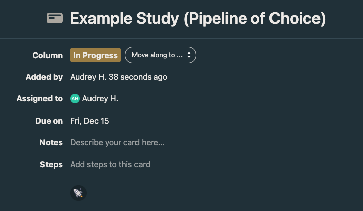

# Best Practices for Data Processing

Below are steps that should be followed in order to ensure your processing efforts go as smoothly as possible. 


1. Create a basecamp data processing card for the study your processing with the codebase you are using [here](https://3.basecamp.com/5032058/buckets/32547817/card_tables/6094386297). We also recommend doing this for analysis and transfers. 
    
2. Add steps to your card, including everything you intend to do within this list as it applies to your codebase and study.
    
3. Determine where your data is and if you need to transfer it to a new location.
    - If your data is large on the MSI, it should be stored on the [s3](s3.md). To make this determination, see [here](storage.md).
    - If your data is on another system (not MSI), you will need to transfer it. See [here](uploads.md) to determine the best method for your dataset.
4. Once your data is on the MSI, determine if has been (properly) converted to BIDS.
    - Even if the person that provided the data to you says it has been successfully converted to BIDS, you should run [CuBIDS](bids.md) on the dataset.
    - If you're starting with DICOMs, see [here](dcm2bids.md) for BIDS conversion tips.
    - If you have NIFTI files that are not BIDS-compliant, you will more than likely have to write a script to finish the conversion.
5. Create a working directory in the project folder for the share you intend to work on. This is where you will put your job wrappers, logs, and status updates. Make sure to name the folder intelligently based on the study and codebase you are running.
    - Make sure to check the `groupquota` to ensure there's room for your process.
    ```groupquota -g share_name```
    - Do not put ABCD information of any kind on `faird`.
6. Copy the respective [SLURM wrapper](wrappers.md) into your working directory and make adjustments for your data location and codebase. 
    - As you make your edits, you will need to test that it works. Instructions on modifying the script and testing are [here](wrappers.md).
    - Note: it is possible that a wrapper does not exist for your codebase already, and you will have to adapt a current one to fit your needs.
7. Estimate the space and resources needed for your outputs by running the codebase you intend to run on all subjects on 3-5 first. For more information, see [Data Storage/Tracking](storage.md) and [Optimizing SBATCH Parameters](optimizing-sbatch-parameters.md). Adjust the resources for your jobs accordingly.
8. Submit the rest of your jobs.
    - Follow [Optimizing Your SLURM Queue](queue-optimization.md)
9. Determine which subjects have been processed successfully.
    - If you are using ABCD-BIDS, you can check the status using [our audit](status.md)
10. Re-run the "easy to fix" errors. These include: s3 quota errors, timeouts, and out of memory errors. We have a codebase that looks for these in your error logs (ADD LINK TO PAGE ONCE IT IS MADE.)
    - Note: it is advisable to create a new `output_logs` and `run folder` each time you submit a new batch of subjects. This will greatly improve your troubleshooting experience.
11. Determine which subjects have been processed successfully. (Yes, again.)
    - If you are using ABCD-BIDS, you can check the status using [our audit](status.md)
12. Rank the remaining failed subject's errors by percentage of total subjects.
    - If none of the errors are greater than 10%, ask the people who want the data processed if they want you to dig into the more difficult errors. This usually depends greatly on the size of the study.
13. Create a descriptive tracking document of your subject counts.
    - Successfully processed
    - Failed processing categorized by why they failed
    - Ideally, all the subjects left to process will be due to bad data, but that rarely actually occurs.
14. Archive your work directory.
    - Sync your working directly up to an s3 bucket that you maintain with all of your working directories.
    - Someone will ask you questions later, and this will be where your answers are.
15. Add your dataset to the [data tracking sheet](https://docs.google.com/spreadsheets/d/1QpKYJQqhuxoQhErBscAEev9npsd1RgKS8KdCL6FiuEo/edit#gid=0).