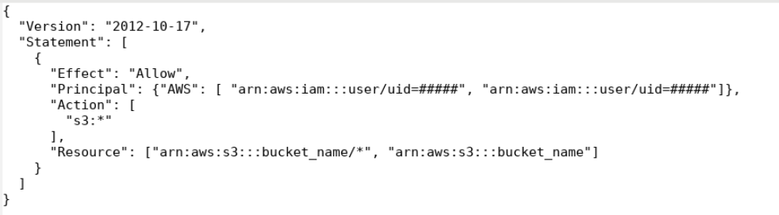

# S3

Read: [s3cmd usage page](https://s3tools.org/usage)

For a comprehensive introduction to s3, see [this tutorial video](https://drive.google.com/drive/folders/1Oz3i5lbld5VmXGdhWagOMWYOIJmgrJA4) (recorded as part of the Data Processing Workshop hosted for undergraduate research assistants). It is encouraged to watch this tutorial prior to your first time using s3 commands. Note that after you run workbench commands, make sure to module rm workbench prior to doing any s3cmd commands.

18. Setting up the bucket and basic commands:

    - To make a new bucket, use: s3cmd mb s3://bucket_name/

    - To see what is inside the bucket, use: s3cmd ls s3://bucket_name/

    - To add a file to the bucket, use: s3cmd sync path/to/directory s3://bucket_name/

        - If trying to upload data to an s3 bucket, make sure to first grab an srun interactive job (2.1.d.)

    - To remove a file in a bucket, use s3cmd rm s3://bucket_name/ --recursive 

    - To remove a bucket, use s3cmd rb s3://bucket_name/ --recursive 

    - To sync a file from your s3 bucket, use: s3cmd sync s3://bucket_name/file_name /path/to/where/you/want/the/directory/to/go/

    - To add a directory to the bucket, use: s3cmd sync --recursive dir_name s3://bucket_name/ 

        - If your job runs out of time before the data upload is complete, use s3cmd sync --recursive --no-check-md5 to restart the upload process where it left off and assure 
        everything makes it. Run this even if the sync says complete to validate

    - To check the size of a single bucket: s3cmd du -H s3://bucket_name/

        - This process can take awhile and an srun will most likely be needed

    - To understand how much of your individual s3 quota you have used (each person in the lab is allocated 120TB of s3 space): s3info -u x500

    - For more s3 command usage, see [here](https://s3tools.org/usage).
    
78. Setting an S3 policy on MSI:

    - Must use this path for your ~/.bashrc to be able to use the set_s3policy command: export PATH=/home/dhp/public/storage/s3policy_bin/:$PATH 

            To open your ~/.bashrc and modify it, use emacs ~/.bashrc &

    - To check who already has access to the bucket, run: /home/faird/shared/code/internal/utilities/MSI-utilities/s3_get_x500/get_x500.sh s3://bucket_name/ 

        - Note that this won't include you, so don't forget to include yourself, especially if it isn't your bucket (you can revoke your own access).

    - Then use this command to set the s3 policy: set_s3policy x500_1,x500_2  bucket_name FULL. The bucket name does not need to have the s3:// prefix in this command 

    - **IMPORTANT: every time you set a policy you need to list EVERYONE that needs access. You CANNOT just list that one person's x500 or only that one person will have access to the bucket! (Along with the bucket owner)**

20. Instructions to the manual method of setting an s3 policy on MSI can be found at [this link](https://www.msi.umn.edu/support/faq/how-do-i-use-s3-buckets-share-data-tier-2-storage-other-users). An example policy file that gives full access to the s3 bucket  “bucket_name” is as follows:

    