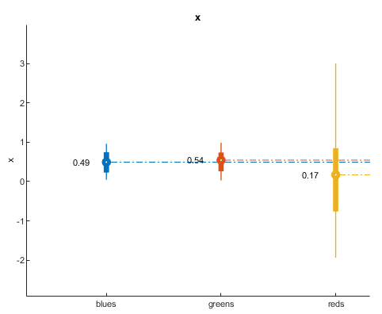
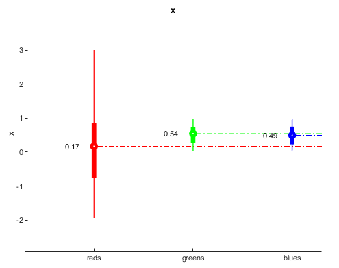
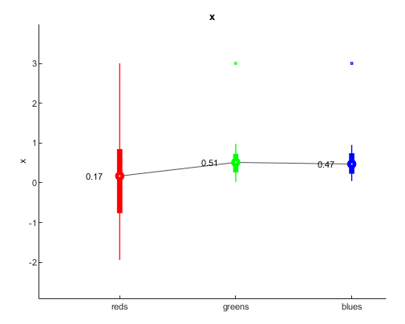
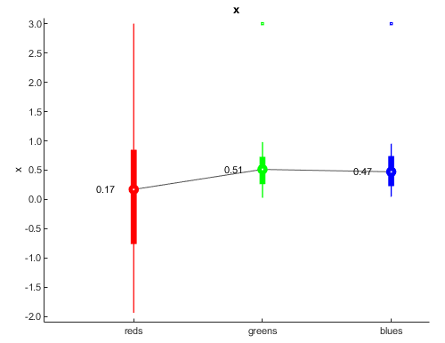
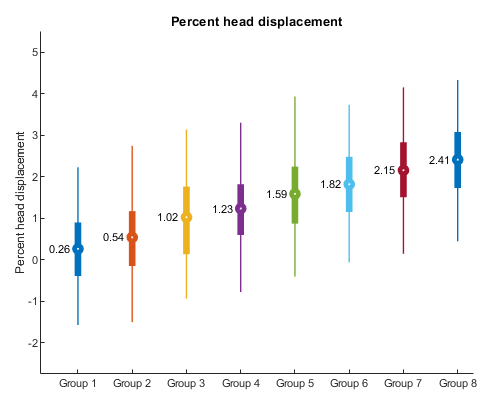

# Skinny Plot

This code visualizes distributions as thin lines highlighting the following values:

* mean value as a circle

* interquartile range using thick lines

* percentiles 5 and 95 using thin lines

The code has multiple options that allow the user to resort the order of each distribution, link the mean values using lines, project lines from the mean to the y-axis and more. The code can be found on MSI at `/home/miran045/shared/code/internal/utilities/plotting-tools/skinny_plot/`. All code and documentation originally developed by Oscar Miranda-Dominguez.

This function requires an input of a table with 2 columns: the first column should have the labels and the second column should have the numbers to be displayed. There are other arguments that can be used. Below are some examples of what can be created with this tool

## Simple Plot

```
% Make some data
rng(0)% for consistency
n1=100;
n2=120;
n3=80;
x1=randn([n1 1]);
x2=rand([n2 1]);
x3=rand([n3 1]);

% add potential outlier | Will be highlighted on example 3
x1(end)=3;
x2(end)=3;
x3(end)=3;
x=[x1;x2;x3];


labs{1}='reds';
labs{2}='blues';
labs{3}='greens';
labels=[repmat(labs(1),n1,1); repmat(labs(2),n2,1);repmat(labs(3),n3,1)];


T=table(labels,x);
skinny_plot(T)
%
% You can see that it assigns default colors and sorts the labels
% alphabetically
```



## Change color and resort 

```
resort_groups=[3 2 1];
% resort_groups=[1 2 3];
my_color=[0 0 1;0 1 0;1 0 0];

skinny_plot(T,my_color,...
'resort_groups',resort_groups)
```



## Additional options 

```
dotted_line_flag=0; %options are 1 and 0
show_text_flag=1;%options are 1 and 0
linking_line_flag=1;%options are 1 and 0
ol_flag=1;%options are 1 and 0

skinny_plot(T,my_color,...
'resort_groups',resort_groups,...
'dotted_line_flag',dotted_line_flag,...
'show_text_flag',show_text_flag,...
'linking_line_flag',linking_line_flag,...
'ol_flag',ol_flag)
```




## Define limits for visualization

```
yl=[-2.1 3.1];
skinny_plot(T,my_color,...
    'resort_groups',resort_groups,...
    'dotted_line_flag',dotted_line_flag,...
    'show_text_flag',show_text_flag,...
    'linking_line_flag',linking_line_flag,...
    'ol_flag',ol_flag,...
    'yl',yl)
```



## Show multiple traces 

```
n_labels=8; % define number of labels
N_max=1000; % define the maxiumum number of elements each label will have
n_elements_per_label=randi(1000,[n_labels 1]);% indicate how many elements each sample will have with a maximum of 1000

x=cell(n_labels,1);
labels=cell(n_labels,1);
offset=.3;%add an offset to each group


% trick to be able to concatenate labes
nzeros=ceil(log10(n_labels));
to_format=['%0' num2str(nzeros) '.f'];


for i=1:n_labels
x{i}=randn(n_elements_per_label(i),1)+offset*i;
labels{i}=repmat(['Group ' num2str(i,to_format)],n_elements_per_label(i),1);
end


x=cat(1,x{:});
labels=cat(1,labels{:});


T=table(labels,x);


% The name used in the table that has numbers is used in the figure
T.Properties.VariableNames{2}='Percent_head_displacement';


dotted_line_flag=0;
skinny_plot(T,[],...
'dotted_line_flag',dotted_line_flag);
% notice that to preserve default colors and add optional arguments, the
% second input argument needs to be empty
```




For questions, suggestions, or to note any errors, post an issue on our [Github](https://github.com/DCAN-Labs/cdni-brain/issues).