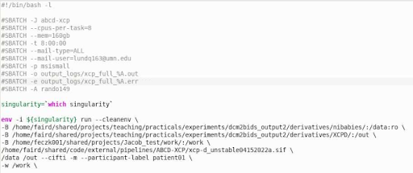

# sbatch/srun Parameters 

## srun: immediately run a command using the specified compute resources

Read: [Interactive queue use with srun @ MSI](https://www.msi.umn.edu/content/interactive-queue-use-srun)

1. **srun** is primarily useful for jobs that will take longer than 10-15 minutes to run on a login node; 15 minutes is the maximum runtime on the login node (the login node is the node you are on after logging into mesabi/agate/mangi). However, they are also very useful for loading a Matlab session (or something similar) with sufficient resources. 
2. This will allow you to work directly in a terminal, allowing you to run (resource intensive) software on it; you get the results in your terminal and you cannot write other commands until it is finished. (If you append the “&” symbol to the srun command it will execute in the background, allowing continued use of the current terminal.)
    * Results that are displayed in the terminal will typically be the steps outputted when opening an application. Terminal outputs from an interactive session are known as `stdout` and `stderr` files for an [sbatch](slurm-params.md#4-2-sbatch-copies-the-script-in-an-internal-storage-and-then-uploads-it-on-the-compute-node-when-the-job-starts) job.
3. If you disconnect, you will lose control over srun jobs, or they might be killed (depending on whether they use stdout or not). They will also be killed if the machine to which you connect to submit jobs is rebooted. NICE or NX are recommended to prevent this, as the virtual desktops save your working environment. 
4. Ex: `srun --time=8:00:00 --mem-per-cpu=8GB --cpus-per-task=4  -A feczk001 --tmp=20gb  -p interactive --x11 --pty bash`
    * This interactive job is grabbing 8 hours on 4 cpus on the interactive partition with 8 gigabytes of memory per cpu, 20gb of temporary storage total, x11 enabled, and the ability to use your terminal, utilizing the feczk001 account’s allocated resources.
    * Use `groupquota` to check which account you are currently using. If the account you specified in the interactive job does not match the account listed when you run `groupquota`, then use `sg {share}` to switch to the specified account. Then use `groupquota` again to make sure you are now on the correct share.
    * x11 forwarding (`--x11`) enables X11 graphical apps to render correctly via remote connection.

## sbatch: copies the script in an internal storage and then uploads it on the compute node when the job starts 

Read: [Job Submission & Scheduling @ MSI](https://www.msi.umn.edu/content/job-submission-and-scheduling-slurm)

    The job script needs to stay the same until the job starts to produce the correct results. If you make changes to a script before the job starts, those edits will be reflected in the job. 

1. Results are written out as your script specifies. `stdout` and `stderr` will be outputted if the `-o` and `-e` flags are specified, and you can submit other commands right away.
2. An sbatch job is handled by Slurm; you can disconnect (not run interactively), kill your terminal, etc. with no consequence
3. To run an sbatch, use this command: `sbatch scriptname.sh`
    1. scriptname -> the name of the job script 
    2. Example sbatch layout: 

    

    3. The above example uses `#!/bin/bash -l` to clarify that this is a bash script.
    4. The name of the job is “_abcd-xcp_”, which is a descriptive name that will appear when running `squeue -al --me` in the command line. 
    5. It will send all types of mail to the specified email address “lundq163@umn.edu”
    6. The resources utilized by this sbatch job include:
        * a maximum time of 8 hours 
        * 8 cpus per task 
        * queueing on the `msismall` partition (mangi/mesabi)
        * 160 gigabytes of total RAM 
        * utilizing the account _rando149_’s queue
    7. There are full paths to a directory that will hold both `stdout` and `stderr` files, which are listed above as `output_logs/xcp_full_%A.out` and `output_logs/xcp_full_%A.err`. The `%A` signifies that the job ID number will be added to the filename.
        * Note: make sure that the _output_logs_ directory exists prior to job submission, if you choose to use one. You can also change that path or not have a sub folder altogether if you want. It is recommended to specify the full path.
    8. All of the text after the #SBATCH parameters are the commands needed to run an XCP-D [singularity container](containers.md). This is one example of what can be in an sbatch, and it can be substituted for any command that may need to be run via an sbatch. 
        1. The input and output directory paths are bound to the container’s filesystem using the `-B` syntax. There is also a path to a `.sif` file that will utilize the jobs resources in order to produce the desired outputs using what's in the input directory. This .sif file is a[ singularity image ](containers.md)that is being run on the specified input files. The input path is described above as `/home/faird/shared/projects/teaching/practicals/experiments/dcm2bids_output2/derivatives/nibabies/`. The output path is `/home/faird/shared/projects/teaching/practicals/experiments/dcm2bids_output2/derivatives/XCPD/` and the path to the singularity image is `/home/faird/shared/code/external/pipelines/ABCD-XCP/xcp-d_unstable04152022a.sif`  
            * Note: these input, output and singularity image paths need to exist prior to running the sbatch. 
        2. The pipeline specific flags `--cifti` `-m` `--participant-label` and `-w`.
            * --cifti will postprocess cifti files instead of niftis
            * -m will combine all the runs into one file
            * --participant-label is a space delimited list of participant identifiers or a single identifier
            * -w is the path to where intermediate results should be stored. In the above sbatch, it is specified in the line that reads `-B /home/feczk001/shared/projects/Jacob_test/work/:/work \` and is called on again later in this line `-w /work \`