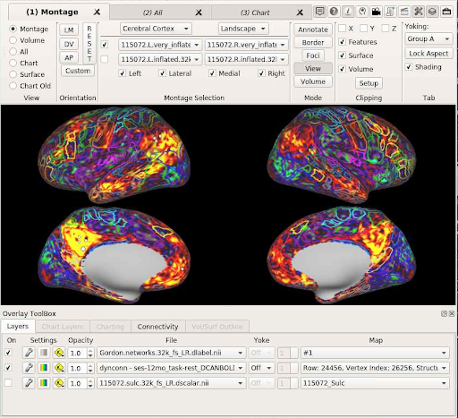
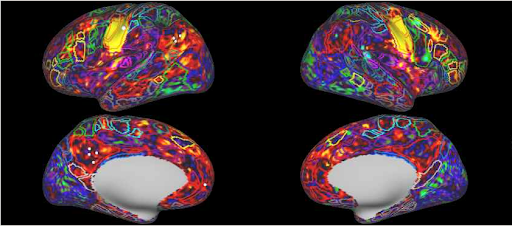
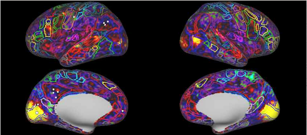

# Troubleshooting and Image Viewing

For any processing failures, we triage what happened. Most troubleshooting processes will be needed for infant data, as their processing jobs are more prone to errors. When encountering a processing failure, first check to see if it is already documented in the following pipeline dependent links. It is also necessary and efficient to post your error and run command in #questions or the relevant channel on Slack. If you are unsure what your “relevant channel” is on Slack, ask your supervisor or just default to posting in #questions. 


Image viewing is a necessary process to conclude if a pipeline job finished successfully, but it also may be necessary when a processing error has been encountered. There are a few different options for viewing anatomical images. It may be most efficient to first download the images locally and then use ITKsnap to view them. However, when working on MSI, applications such as `fslview_deprecated` or `fsleyes` can be used. For viewing functional images, `wb_view` is ideal (make sure to `module load fsl` or `module load workbench` before using these applications). For more information on nifti and cifti files (image file types), refer to the video sessions in the subfolders of [this google drive folder](https://drive.google.com/drive/u/0/folders/1yc3w2zNYVZQvTcCgxKk_j6ecZLoyWiCM).


## DCAN Infant Pipeline (infant-abcd-bids-pipeline)

### Inspecting Slurm and pipeline logs for errors

Slurm logs are the stdout and stderr files from a Slurm job. The first thing to do when a job no longer is running is check the Slurm logs. Each job will have an output (`.out`) and error (`.err`) Slurm log.

MSI outputs these into a single .out file by default, in the directory you called the submission script from.

Type `scontrol show jobid -dd &lt;job id num> | grep Std` to see the paths for StdErr, StdIn (usually /dev/null), and StdOut for any slurm job currently in the queue.

Common errors include the following:

#### Job Failed Before Pipeline Started

The lab's scripts copy the BIDS input, templates, etc. to the node before they run the pipeline. If any of that failed, the Slurm logs should tell you what happened.

Jobs (e.g. Slurm on MSI) will not start if you don’t have write access to where the logs should go


#### Job Failed After Pipeline Started

The lab's scripts print the string `RUNNING DOCKER IMAGE` just before calling the pipeline. Before starting each stage, the pipeline prints a line that says `running `followed by the name of the stage.

If the job succeeded (i.e., the pipeline successfully ran all the way through all of the stages), the Slurm logs will have a message that contains `BEGINNING SUCCESS CLEANUP`. If the job failed, the slurm logs will have a message that contains `BEGINNING FAIL CLEANUP`. The most common failures are described here.


#### Job Timed Out

If the slurm logs say the job caught an exit code of 140 or 240, the job timed out. Slurm jobs in the exacloud partition time out after 36 hours. (When using the lab's scripts, jobs are allowed to run for just 34 hours so that they have a good chance of copying all the job's data back to lustre1.)

Look higher in the output log to find the last stage that was started. Copy the name of the last stage exactly (case matters). Resubmit the job, starting with that stage.


#### Job Exception During Stage

If the job failed but did not time out, the Slurm error log will usually have a line that says `Exception: error caught during stage:` followed by the name of the stage. Note the stage name. That's the stage to start from when you resubmit, _after _you figure out why it failed and fix the problem. This usually requires looking at the pipeline logs. To find them, look at the bottom of the Slurm output log for the string `COPY PROCESSED DATA TO` to find the path to the data for that study. Go to that path and then into the tree for `&lt;subject>/&lt;session>/logs/&lt;stage>`.

When using pipeline logs, remember: cascading errors are of no use to you; you only care about the _first _error that happened in the stage. See following sections for how to troubleshoot errors in various stages of the pipeline with the pipeline logs.

### Troubleshooting Anatomical Errors in Pipeline Logs

The stages that constitute anatomical processing are PreFreeSurfer, FreeSurfer, and PostFreeSurfer. The following are common errors we see when processing infant data with the DCAN pipeline:


#### No aseg_acpc.nii.gz File

The first stage of the pipeline is PreFreeSurfer. The most crucial file that should come from this stage is its segmentation, aka aseg (`files/T1w/aseg_acpc.nii.gz`).

If PreFreeSurfer failed to make the aseg, look in the PreFreeSurfer error file for the first error. If the error occurred in JLF, resubmit your job. JLF fails intermittently and the job may succeed next time.

If the first error was before JLF, or if you run this multiple times and JLF fails each time, refer to the section on [inspecting the intermediate pipeline output files](https://github.com/DCAN-Labs/data-processing-handbook/edit/lucibranch/docs/troubleshooting.md#inspecting-the-data-for-quality-or-processing-issues) to troubleshoot.


#### FreeSurfer failed in mri_normalize

In both of FreeSurfer's logs you will find the string `ERROR: After mri_normalize, &lt;subject id>/mri/T1.mgz does not exist.` In the error file, you will also find the string `Segmentation fault`. This usually occurs when FreeSurfer doesn't like the aseg file.

Note: the use of the word "segmentation" in this case is coincidence. A segmentation fault is a runtime error in the code, for example, trying to divide by 0 will throw a segmentation fault. It just so happens that the segmentation fault can happen in mri_normalize when there is a problem with the aseg file. But it can also happen if there is a problem with the mask. So do not assume that a segmentation fault always refers to the segmentation file. This is one reason I often refer to the segmentation file as the aseg.

If you were using an aseg supplied from an external source (other than PreFreeSurfer) the file might have an orientation or dimension or other property that is not what FreeSurfer expected. Or, if you were using a mask from another source, the aseg file and the mask file might not have the same dimensions. Or it could just be that the aseg was not very good.


### Troubleshooting Functional Errors in Pipeline Logs

These pipeline stages process task data: FMRIVolume, FMRISurface, DCANBOLDProcessing. When you go to any of those subdirectories in the processed data logs, you will find multiple output and error files: one for each task/run combination that was processed when the pipeline failed, and, in some cases, files for setup and teardown steps.

The runs are processed in parallel, and the pipeline does not fail until all of the steps of the stage have either passed or failed, so you cannot assume the last run is "guilty". Also, more than one run might have a problem. The quickest way to check what failed is to look at the file called `status.json`. You will see something like `stage terminated with exit code [0, 0, 1, 1]`. In this example, 2 steps failed, and they were the 3rd and 4th steps. If the stage has a setup and teardown (like DCANBOLDProcessing), then this status would tell you that setup and the first run succeeded, the second run failed, and teardown failed. If this `status.json` were found in FMRIVolume, then the 3rd and 4th runs failed (because there is no setup or teardown in FMRIVolume). Just look around at the output and error files available in the directory and it should make sense.

Another way to check which step failed is: type `tail *.err` which will show the last 10 lines of each error file. Each run that succeeded will end with a message to indicate that the stage completed. For example, each successful run in FMRIVolume would have the message, `GenericfMRIVolumeProcessingPipeline.sh - Completed` at the end. Any file that does not have such a message has had an error. Open the file and look for the first error.


#### FMRIVolume Could Not Create a Scout File

The most common error in FMRIVolume occurs when a Scout file cannot be created. In the current version, you will find `Too few frames...Exiting`.

We try to use the 17th frame in the file to make the Scout file because the babies have settled a little bit by then. We can use a different frame, but, if there are &lt; 17 frames, the data is not much use. The fix is to remove that file from your `func `directory so that the pipeline will not try to process it. You can restart at FMRIVolume, since no `func `files will have been used before this stage.

#### FMRISurface Did Not Find All ROIs

During FMRISurface we attempt to map the subcortical areas. If you ran using ROI_MAP as your subcortical-map-method (the default), the pipeline split the subcorticals and attempted to map each. The pipeline expected to find 19 regions of interest (ROIs). Sometimes an aseg will not have all 19 ROIs. The error log for the run will have the string `ERROR: cifti xml dimensions must be greater than zero`. 

Which subcortical was missing may not matter to you. The message means the run cannot be used as is, so you can decide to eliminate that run. But if you want to debug further, look at the line above that message. It will say something like:


```
    wb_command -cifti-create-dense-timeseries /output/.../files/MNINonLinear/ROIs/task-rest_run-01_working_directory/task-rest_run-01_temp_subject_ROI0008.dtseries.nii -volume sub2atl_vol_masked_ROI0008.nii.gz /output/.../files/MNINonLinear/ROIs/task-rest_run-01_working_directory/sub2atl_vol_label_ROI0008.nii.gz
```


From the message you can find:


* The working directory. Since the job was probably run using Docker, the path to the working directory cannot be used “as is”. Your data will have been mounted to `/output`, so you would substitute the appropriate path for `/output`. Hint: the working directory will always be `files/MNINonLinear/ROIs/&lt;frminame>`. 
* The first ROI for which no data was found. In our example, ROI0008. Since the ROI files are made using `wb_command -volume-all-labels-to-rois`, the ROI numbering starts at 0. That is, ROI0000 is the name used for the 1st ROI. So ROI0008 represents the 9th ROI. 

Go to the working directory (it will not have been removed since there were errors), andl find a file named `labelfile.txt`. The file has 2 lines per ROI, so, for the 9th ROI, you want to look at lines 17 and 18:


```
    17: ACCUMBENS_LEFT
    18: 26 255 165 0 255
```


The first missing ROI was the left accumbens. Its FreeSurfer label was 26 (that is, if you viewed the file with fslview, its “intensity” would be 26). If you have a way to correct the aseg, that is the ROI you need to add.

There might be more missing ROIs; the command died at the first one.


### Inspecting the data for quality or processing issues

1. First follow established SOPs to check that the input data is high quality enough to be processed: see *Structural Pre-Processing Quality Assessment of BIDS* under [Quality Control for Infant Data](https://data-processing-handbook.readthedocs.io/en/latest/infant-qc/#structural-pre-processing-quality-assessment-of-bids-input-data)

2. Check the executive summary to spot errors/quality issues in the pipeline outputs: see _Input Data_ and *Post-Processing Quality Assessment from Executive Summary* under [Quality Control for Infant Data](https://data-processing-handbook.readthedocs.io/en/latest/infant-qc/#post-processing-quality-assessment-from-executive-summary)

3. For more in-depth quality assessment that involves inspecting intermediary pipeline outputs, see the [Troubleshooting](https://dcanlab.readthedocs.io/en/latest/manualpro/infant/troubleshooting/) section (includes information on inspecting file outputs from PreFreeSurfer, atlas registration, and functional/structural registration)

4. For issues with dense time series files, see [Checking for NaNs and zeros in dtseries](https://docs.google.com/document/d/1dvpISFRuyKDW0Fc9OCu3GO2GOOlMZ-K8w0PPLtD3oH8/edit) to double check for NaNs

## ABCD-BIDS

In the Infant section above, points 3-4 can be generalized for ABCD troubleshooting as well, but are typically errors more commonly found with infant vs adult processing. For a generalized spot check of abcd-hcp-pipeline outputs for functional data, use workbench view: 

1. For the abcd-hcp-pipeline functional spot check example, our goal is to get a scaffolding of brain activity. In order to see if brain activity is well represented as functional connectivity, we have to look at the BOLD data (a functional output image). This process can give insights as to whether the processing pipeline has an underlying issue that's been overlooked or if the data has been collected poorly.

    * Run `module load workbench`

    * Navigate to your output directory. This is an example output directory: `cd /home/feczk001/shared/data/ABCC_year2_sites/sub-####/ses-$$$$/files/MNINonLinear/fsaverage_LR32k`

    * Run `wb_view` then select *Open* and *Load* for all the files

    * In the _Montage Selection_ section, switch the selected surfaces from _midthickness_ to *very_inflated*

    * Deselect all three of the layers in the _Overlay Toolbox/Layers_ section 

    * Go to *File* and *Open File*, switch the _Files of type_ section to _CIFTI - Dense Data Series Files (*.dtseries.nii)_

    * Navigate up one directory then down into the *Results* folder

    * Select a _task_rest dtseries.nii_ and open it 
    
    * Go to *File* and *Open File*, and navigate to the parent folder (`feczk001/shared/`). From here open _ROI_sets_, _Surface_schemes_, _Human_, _Gordon_, and _fsLR_
    
    * Switch the _Files of type_ section to _CIFTI - Dense Label Files (*.dlabel.nii)_
    
    * Open the *Gordon.networks* file
    
    * Back in the _Overlay Toolbox/Layers/File_ section, switch the first two files to the *Gordon.networks* file and the *dyconn - task-rest* file, and check the box under _On_ for those two files
    
    * For the *Gordon.networks* file, click the wrench icon under *Settings* and in the *Labels/Drawing Type* section, select *Outline Label Color*, then select *Close*.

        From here, select points on the brain images to see if the more yellow colors in the _dyconn_ file correspond to the areas outlined by the _Gordon.networks_ file. Focus on distinct networks like the Visual, Motor, and Default Mode. If the seed maps (_dyconn _file) don’t correspond well with the networks, there may be an issue with the data acquisition or the pipeline. For a more in-depth look at this process, see [here](https://umn.app.box.com/file/980329914631). 

2. For data processed with the abcd-hcp-pipeline, the final outputs will always be in the `MNINonLinear/fsaverage_LR32k` folder, i.e. atlas transformed outputs.

3. Below is an example of what `wb_view` should look like. The order of the networks seen below are Default Mode, Motor and Visual. The overlays for each all look fairly accurate, as the yellow activation areas correspond to the network region where the voxel was selected. Important to note that one will need to select multiple voxels within a network region in order to identify whether the BOLD activation truly overlays properly with the networks.






## NiBabies and fMRIprep

For a comprehensive document on troubleshooting nibabies and fmriprep errors, [see here](https://docs.google.com/document/u/0/d/16qSEPV1_FHOHBq2eJOuZLqISv-0zCbpOJQ7HesEQCv4/edit).

## XCP-D

For common troubleshooting processes and a deeper dive into the utilization of XCP-D, [see here](https://umn.app.box.com/folder/149404140292?s=3gmexhky3rtxafdo118rh1c0c2x35jl6).

## S3 Wrappers


**If there are run files:**


Errors are common when running preliminary tests on s3 wrappers. In order to troubleshoot these errors, the first step is to grab an [interactive session](slurm-params.md#srun-immediately-run-a-command-using-the-specified-compute-resources). Next, run the content of one run file by copying and pasting the contents into the terminal step-by-step in order to see the outputs of each command in real time, which will uncover the step in which the error is occurring. Once the error is reproduced, incorporate the fix, then rerun `make_run_files.sh` and a test subject for the submitter script.
Note: it is helpful to check the `tmp/` directory and the s3 bucket to validate file and directory paths in the template/run files themselves.


**If there are not run files:**


The issue should be regarding the paths to the files in `make_run_files.sh.` With `make_run_files.sh` opened, copy and paste the contents of the file into the terminal in order to see if the conditional statements match the necessary paths of the files that need to be included. 
