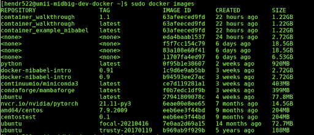

# Virtual Machine (Container Building)

DCAN Labs has access to a Virtual Machine (VM) for the purpose of building Docker application containers (Docker builds require root access, which is not permitted to general users on the main MSI clusters, thus the need for the VM). The process to sign up for access to MIDB's VM for use with container developing is as follows:

## How to Get VM Access

1. Reach out to both Kim (kweldon@umn.edu) and Luci (lmoore@umn.edu) and indicate that you would like access to the container, what project(s) it is needed for, and why. 
2. Read the below *How to Use the VM* section Audrey put together on how to properly use the VM.
3. After you get approval to request access from Luci or Kim, request access from OIT by submitting a ticket to help@umn.edu. Here is a template for the email:

            Subject Line: Add me to VM: umii-midbig-dev-docker.oit.umn.edu
            Body: 
            Hello, 
            Can you please add me to the VM: umii-midbig-dev-docker.oit.umn.edu? My x500 is <x500>. 
            As is the case with all other users please give me SUDO privileges to the VM.

4. After you receive access, try the following test to ensure that your access is working
    * Run `ssh <x500>@umii-midbig-dev-docker.oit.umn.edu`
    * When prompted enter your UMN ID password and two-factor authenticate with DUO
    * If that all works try testing if you have "sudo" privileges by typing `sudo docker images`
    * If you get an output that looks like the attached picture, you are all set, if not let Kim or Luci know.

    

5. For troubleshooting issues, there is a tiered triage system
    * Kim and Luci will handle minor troubleshooting and access
    * If issues continue to occur, Kim or Luci will reach out to Tim 

## How to Use the VM

Log into a mesabi node and log into the MIDB virtual machine with your credentials 

- Run `ssh -Y <x500>@umii-midbig-dev-docker.oit.umn.edu`

Check that there is room for you to build

- Run `sudo docker images` to check for images already made, there should only be 2 built at once

- Run `sudo du -sh /home/*` and `sudo du -sh /tmp/*` to check the space being taken up by each user - there is 128 GB of shared space

Once you know there is enough space to build your docker image, build your image based off of the dockerfile in the GitHub repo

        git clone git_hub_url
        cd git_repo_directory
        git checkout your_branch
        sudo docker build . -t pipeline:dev_your_issue

Check that your build was successful

- Run `sudo docker images` 

If it wasn't successful, remove and try again; this can happen if the key server was down

- Run `sudo docker rmi image_id`

If it was successful, tar the docker image build, transfer the tar file to MSI to build the singularity image and test it 

- Run `sudo docker save -o tar_file.tar image_id` to save as a tar file

- Run `sudo chown username:username tar_file.tar` to transfer ownership of the tar file from root to you so you can transfer it

- Run `scp username@ovpr-midb-ig-dev.oit.umn.edu:~/path_to_file/tar_file.tar .` on MSI to transfer 

- Start an interactive session with at least 32 GB of temp storage to build the singularity image (`srun -N 1 -n 1 -c 1 --x11 --mem=16gb --tmp=50g -t 720 -p interactive --pty bash`)

- Run `singularity build singularity_image.img docker-archive://tar_file.tar` to build the singularity image 

Clean up your docker image build on the VM

- Run `rm -rf git_hub_repo_dir` to remove the files created

- Run `sudo docker rmi image_id` to remove the image created

**Common Issues**

If you are running into problems with your space/storage

* Is your container too big? 
* Have you cleared out old builds?
* Does someone else have builds on the VM at this time?