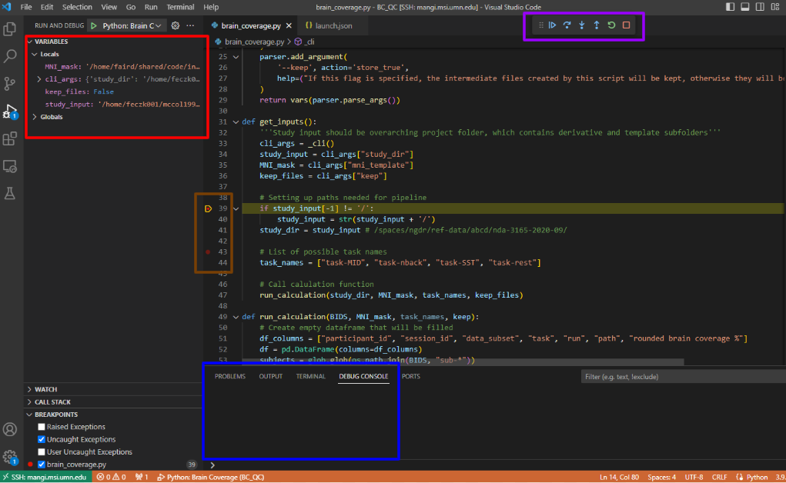

# Using VS Code

VS Code is a free code editor that is optimized for building and debugging code. Its debugging console can be a helpful tool for refining and changing old scripts or developing new ones. VS Code also has the ability to ssh into an MSI terminal, making it incredibly easy for you to work on scripts on MSI. This page will document how to connect to MSI, how to use the debug console, and other important information to allow you to work with scripts.

## Connecting to MSI with VS Code

First, if you have not downloaded VS Code, [install it](https://code.visualstudio.com/download) on your local computer. 

There are several recommended extensions to download through the Extensions Marketplace

- Remote-SSH (needed to connect to MSI)

- Git Graph (a helpful tool for visualizing your git history of commits, merges, branches, etc)

- Python

- Pylance

- Jupyter

If you are not connected to the university network, [connect to a VPN](https://it.umn.edu/services-technologies/virtual-private-network-vpn)

Next you will need to setup SSH keys that will allow you to connect to MSI.

- Open a terminal on your local computer and run `ssh-keygen`

- Copy the contents of `~/.ssh/id_rsa.pub` 

- Open an OnDemand session and open a fresh terminal in your home directory

- In the `~/.ssh/` folder, create an `authorized_keys` file and paste in the ssh key you copied earlier

- Run `chmod 600 ~/.ssh/authorized_keys` after you add the key. This will ensure that the ssh server will see this file

- See [this link](https://www.msi.umn.edu/support/faq/how-do-i-setup-ssh-keys) for more help

Now you need to edit the ssh config file on your local computer to be able to connect to MSI servers.

- Copy the following text into your `~/.ssh/config` file on your local computer, changing USERNAME to your x500. The port numbers are arbitrary and can be changed freely. 

        XAuthLocation /opt/X11/bin/xauth
        ServerAliveInterval 60
        ServerAliveCountMax 120

        Host mangi.msi.umn.edu
        HostName mangi.msi.umn.edu
        User USERNAME
        LocalForward 12326 localhost:12326

        Host cn*
        ser USERNAME
        ProxyCommand ssh -L 12326:localhost:12326 -W %h:%p mangi.msi.umn.edu
        LocalForward 12326 localhost:12326
        ForwardX11Trusted yes

        Host mesabi.msi.umn.edu
        HostName mesabi.msi.umn.edu
        User USERNAME
        LocalForward 12325 localhost:12325
        ForwardX11Trusted yes

        Host acn*
        User USERNAME
        ProxyCommand ssh -L 12325:localhost:12325 -W %h:%p mesabi.msi.umn.edu
        LocalForward 12325 localhost:12325
        ForwardX11Trusted yes

Time to actually connect to MSI!

 - Under the View tab, open the Command Palette and search for Remote SSH: Connect to Host. Mangi and Mesabi should both be listed as options.

    

    

    

 - Select a cluster, this is open a new window that will prompt you for the ssh password you set up when you set up your keys

 - In the bottom right corner a box with pop up that says "Setting up SSH Host cluster.msi.umn.edu (details)", click details to complete the DUO authentification 

 - Now you will need to install the same extensions as before but on the remote server  
    
    - Refer to the instructions as earlier, just make sure you are connected to MSI

It is best to not run VS Code on a login node, as it takes up a decent amount of CPU and memory to run, so instead connect to a compute node.

- Once you are connected to MSI, open a new terminal and grab an srun

    - `srun --time=8:00:00 --ntasks=2 --mem=32G --tmp=20G --pty bash -l`

- Make a note of the compute node you are allocated (`cnXXX` or `acnXXX`)

- Open the command palette again and select Remote-SSH: Connect to Host and enter the compute node 

- You'll be prompted to enter your ssh password and duo again

- It will also ask you to save the host fingerprint, select Continue/yes then enter your ssh password again to connect

When you are done using MSI, it is good practice to close the connection

- Click the box in the very bottom left side of the screen that says SSH: cluster.msi.umn.edu

- A command palette box will pop up in the top middle of your screen. Select Close Remote Connection.

If your session keeps timing out before it connects, open VSCode settings, search for "connectTimeout" and increase "Remote SSH: Connect Timeout" to 60.

## Conda environments

### Activating your base environment

First we want to set up VSCode to automatically activate your base python envionrment. This will allow VS Code to save any python packages you download to your base by default. This way, if you already have a package available in your base directory, it will automatically use that between environments you've already activated. 

Activate your base conda environment by running `conda init` (may need to run `module load conda` first)

- This should add the following code block to your .bashrc which will automatically activate your base environment. 

        # >>> conda initialize >>>
        # !! Contents within this block are managed by 'conda init' !!
        __conda_setup="$('/panfs/roc/msisoft/anaconda/python3-2020.07-mamba/bin/conda' 'shell.bash' 'hook' 2> /dev/null)"
        if [ $? -eq 0 ]; then
            eval "$__conda_setup"
        else
            if [ -f "/panfs/roc/msisoft/anaconda/python3-2020.07-mamba/etc/profile.d/conda.sh" ]; then
                . "/panfs/roc/msisoft/anaconda/python3-2020.07-mamba/etc/profile.d/conda.sh"
            else
                export PATH="/panfs/roc/msisoft/anaconda/python3-2020.07-mamba/bin:$PATH"
            fi
        fi
        unset __conda_setup
        # <<< conda initialize <<<

- Now when you run `which python`, it should match the folder path above (`/panfs/roc/msisoft/anaconda/python3-2020.07-mamba/bin` in this example)

Your base environment is automatically located in your home directory, but you can store packages in an external file path to prevent your home directory filling up by adding a path to your .condarc. 

- If you do not have a `.condarc` in your home directory, run `conda config`. This should create an empty .condarc.

- Add the below line to the top of the file, replacing SHARE with whichever share you would like and substituting in your MSI usermane. 

        pkgs_dirs:
            - /home/<SHARE>/shared/code/external/envs/<MSI_USERNAME>/conda/pkgs

### Creating a new conda environment

Each repository should include its own conda environment so that different users are sourcing consistent packge versions. Some pacakges can also be tricky to set up, so this removes the initial work that people need to do to use a repository. The `conda create` command will create a new conda environment. In general, name your envionrment something easily identifiable to whatever repository that environment is for, with *-env* at the end. The example command below creates an environment for the custom clean repository. 

`conda create --prefix /home/faird/shared/code/external/envs/custom_clean-env python=3.9 --name custom_clean`

* Include a name for the environment with the `--name` flag to make it easier to activate.

* Environments that are used for ABCC related repositories are stored in `/home/rando149/shared/code/external/envs`. 

### Activating a new conda environment 

With your script open, open the command pallete (Ctrl + Shift + P or in the View tab) and type "Python: Select Interpreter" (assuming you're running a python script). Here, paste the path for the environment you have for this script. Once activated, you should be able to use all the packages within that environment and add more if needed. 

## Using the Debugger

The debug mode can be extremely helpful for troubleshooting code and creating new scripts. It allows for you to quickly test changes and see the errors in real time. This tool is a great way to test smaller scripts but would not work for testing of an entire pipeline, unless you were only testing a section of a pipeline. For more documentation on debugging, see [here](https://code.visualstudio.com/Docs/editor/debugging).

### Setting up the launch.json

To start a debug session, open up VS Code and open the script(s) you want to test. On the left side of the screen, there is a bar of icons. Click the icon that has a play button with a bug. This will open the debug sidebar. If you haven't set up a debug session before, there should be a link in the sidebar that says "create a launch.json file". Click on this to open up the launch.json. This will allow you to feed a set input to your script, set environment variables, and create a specific debug configuration for any script. When you create the launch.json, VS Code will try to guess what debug environment you need (based on what files you have open) but if it can't, you will be able to choose manually. This will create a hidden folder in your directory called `.vscode` where the launch.json will live. 

To add another configuration to your launch.json, copy everything within the curly brackets under configurations and paste it after the curly brackets, adding a comma in between the two curly brackets. You can add as many configurations as you need for however many scripts you want to debug. To make this debug configuration only run on a certain script, under the program variable, add `${workspaceFolder}/my_file.py`. This will look in whatever folder you currently have open for the script you want to debug. Be sure to name this configuration something easily identifiable. If your script has arguments, add an `"args"` key. For whatever arguments you need, add them in this format `["--arg=argument, --arg2=argument2"]`. This allows you to always debug with consistent arguments without having to specify them each time. To add environment variables, add an `"env"` key. The format to add environment variables is a dictionary of the format `{"VARIABLE" : "value", "VARIABLE_2" : "value_2"}`. The environment variables in the below example will almost always be helpful to add, as they allow for a single line to run longer than the default max time of .15 seconds. This example allows for for 100 seconds for a line to run, although you can change the time to whatever you prefer. 

            {
                // Use IntelliSense to learn about possible attributes.
                // Hover to view descriptions of existing attributes.
                // For more information, visit: https://go.microsoft.com/fwlink/?linkid=830387
                "version": "0.2.0",
                "configurations": [
                    {
                        "name": "Python: Current File",
                        "type": "python",
                        "request": "launch",
                        "program": "${file}",
                        "console": "integratedTerminal",
                        "justMyCode": true
                    },
                    {
                        "name": "Python: my file",
                        "type": "python",
                        "request": "launch",
                        "program": "${workspaceFolder}/my_file.py"
                        "console": "integratedTerminal",
                        "justMyCode": true,
                        "args": ["--input=/path/to/input/files/, "--output=/path/to/outputs/"]
                        "env": {"PYDEVD_WARN_SLOW_RESOLVE_TIMEOUT": "100", "PYDEVD_WARN_EVALUATION_TIMEOUT": "100"}
                    }
                ]
            }

### Setting up prerun tasks

The task.json is used to set up tasks that need to be run before the script runs, for example if you need to load a MSI module. Open the command pallete and type "Tasks: Configure Task". This will create a tasks.json in the same .vscode folder where the launch.json lives. The "label" variable is what you will use to call the task from your launch.json. The "type" variable is the type of command that you are trying to run. The "command" is the command you want to run. Once you create this prerun task, in your launch.json, add a `"preLaunchTask"` variable in the configuration you need this task for with the value being the "label" you set in the tasks.json. 

Hypothetically if your command was `module load fsl` that would load FSL before your script. However, we have not been able to get this to work. Our workaround is to create a shell script that loads fsl and exports the path to your path. Create a `prerun.sh` script in the same directory where your main script lives. In your tasks.json, the command would be `./prerun.sh` and you have to add the label to your launch.json. Below is an example of a prerun script that should load FSL. When you create this file, be sure to run `chmod gu+rwx prerun.sh` to make sure that VS Code has the permissions to execute the file. If you do not do this, you might run into an exit code 126 error.

        #!/bin/bash

        module load fsl

        FSLDIR=/panfs/roc/msisoft/fsl
        . ${FSLDIR}/6.0.4/etc/fslconf/fsl.sh
        PATH=${FSLDIR}/6.0.4/bin:${PATH}
        export FSLDIR PATH

 **NOTE** : This process still does not seem to work all the time. If just adding this task does not work, before running your script, also run `module load fsl` and `bash prerun.sh` in the terminal. 

### Running the debugger

Now that you are hopefully all set up for a debug session, it is time to actually run and debug your script. Click the debug icon and select whichever configuration you created for this script. If there are points in the script that you want to stop at, create breakpoints by selecting the red dot to the left of the line number(s) you want to stop at (circled in brown). This will make the program stop at these lines as its running. When you start the script, the debug toolbar (circled in purple) should appear at the top of your page. This toolbar can be used to pause/continue the script (pause/play icon), run a method as one command (not line-by-line) (curved arrow), move forward manually line by line (down arrow), finish all the lines of a method as one command (if you're inside a method)(up arrow), restart the debug session with the same configuration (green arrow), or terminate the session (red square). At the left of your screen, you should see all of the variables and their values as the script goes on (circled in red). At any point, if you want to test a block of code or run any commands, open the `Debug Console` located at the bottom of your screen (where the Terminal is also located, circled in blue). This will allow you to run commands as if they were being run in the script, meaning you will have access to the variables and their values. 

