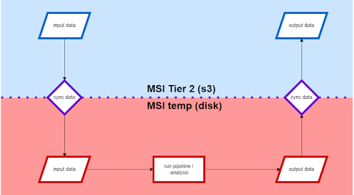

# S3 Pipeline wrappers

_Note: see [s3_wrappers_overview.mp4](https://drive.google.com/file/d/1kr9B0ZGZxHGVj4xzl1qMZYY7Qyeg8TYV/view?usp=sharing) for zoom recording of overview presented at DCAN Hackathon_

Pipeline wrappers exist to submit one subject-session processing job (or analysis) at a time. This allows for improved queueing time of your jobs because you will be requesting less resources per job. Also, partitions have maximum time limits and memory limits that make it almost impossible to run an entire study in one job. The wrapper makes this entire process easier. 

Below is an overview of the s3 wrapper workflow:

Set up a wrapper to create the individual jobs per subject and session pair based on the pipeline parameters, the sbatch parameters, and the storage chosen. Gather the correct wrapper script from github: [DCAN-Labs/slurm_pipeline_wrappers](https://github.com/DCAN-Labs/slurm_pipeline_wrappers) or on MSI at `/home/faird/shared/code/internal/utilities/slurm_pipeline_wrappers/`. Then, copy the wrapper into your own working directory for your project under  `/home/{share}/shared/projects/your_project/`

Current list of wrappers developed for s3 integration:

* QSIprep

* NiBabies

* fMRIPrep

* DEAP-derivatives

* CuBids

* DCAN infant wrapper

* abcd-hcp-pipeline (abcd-bids)

* abcd-dcm2bids

* Continuous slurm array submitter

* s3tos3 file mapper

* Reliability maps

* CABINET

    Each wrapper should have a template file which has generalized commands with variables that get filled with the execution of `make_run_files`. Modifications will also need to be made within the `submit_{}.sh` file. 

1. Submit a test job with the wrapper to assure the wrapper is doing what it should do

2. Example: 

    1. `./make_run_files.sh`

    2. `./submit_ALL.sh` 0-467 (Note: any number scheme may be used provided as long as it is listed as a comma separated list, or as stated in the example, or a combination of both)

**Steps to modify and run pipeline wrappers (using abcd-hcp-pipeline as an example)**

1. Copy the entire folder contents of `slurm_abcd-hcp-pipeline_scripts_with_s3_routines_with_ses` to your project folder to make changes to these scripts in your own directory

2. Modify sync and copy paths within `template.abcd-hcp-pipeline_full_run`. This script includes the actual command to run the pipeline using specified data_dir and subject ID.

3. Generate run files by executing `make_run_files.sh`. This script uses a series of `awk` commands to pull out subject and session ids from input data within your data bucket and creates a run file for each subject under `run_files.abcd-hcp-pipeline_full`. First review the `make_run_files.sh` script to check that the data directory paths look correct and then execute via `./make_run_files.sh`. Note that you may need to grab a node first to run this script if you have a large number of subjects.

    * Before moving on to the submission step, if you are transferring the data via globus, make sure to properly set up the endpoints. See [the section on globus transfers](uploads.md#Globus) for more information.

4. Submit run files to queue w/ `submit_abcd-hcp-pipeline_full_run.sh` with the runs as input. For example if you want to submit subjects 0 through 20 and 25, execute the following from the command line: `./submit_abcd-hcp-pipeline_full_run.sh` 0-20,25. **Note that you most likely want to test your wrapper on one subject before running multiple.**

    * If an error is encountered, see the[ troubleshooting section for s3 wrappers](#23-5-s3-wrapper-troubleshooting-process).